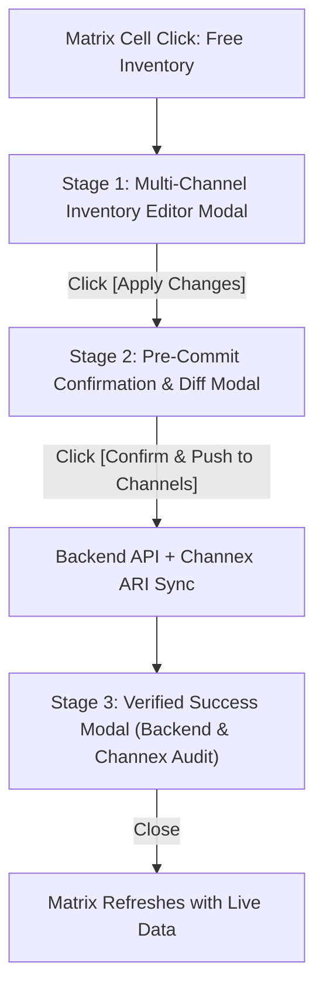

# Rate Matrix Channel Inventory Architecture & Implementation Plan

## 1. Overview & Objectives

In resort and hotel operations, properties distribute their physical rooms across multiple sales channels:
1. **Oreedu PMS** (Internal Front Desk, Walk-ins & Staff Booking Engine)
2. **Oreedu OTA Portal** (Direct Guest Booking Engine via oreedu.com)
3. **Oreedu CP Portal** (B2B Channel Partners & Travel Agents)
4. **Connected External OTAs** (Booking.com, Agoda, Airbnb, Expedia, etc. via Channex)

While room **pricing** can be set 100% independently per channel with zero operational risk, **room inventory** is bounded by the physical rooms in the building. 

The goal of this architecture is to allow property managers to set **distinct Channel Ceilings (Allotment Caps)** for each channel simultaneously from a single, unified Inventory Editor directly on the Rate Matrix:
- Manager can assign **different limits to different channels** in a single operation (e.g. OTA = 3, CP = 4, Booking.com = 5, Agoda = 2, Airbnb = 0).
- Overbooking is physically impossible through the Ceiling Formula: $\min(\text{Channel Limit}, \text{Physical Remaining})$.
- **Oreedu PMS** front desk remains the unrestricted master with real-time access to all unbooked rooms.
- **Both Standard and Group Bookings** are fully supported across **Oreedu PMS, Oreedu Direct OTA, and Oreedu CP Portal**.
- Before committing, a **Pre-Commit Confirmation Modal** summarizes all proposed changes.
- After committing, a **Post-Sync Verified Modal** confirms the exact changes applied by the backend, including live Channex synchronization status for connected OTAs.

---

## 2. Core Architectural Principles

### A. The Channel Ceiling (Allotment Cap) Formula
A channel inventory override does **not** create separate, isolated buckets of rooms that sum up (e.g. 5 physical rooms never become $3 + 4 + 5 = 12$). 

Instead, each channel's override acts as an **upper ceiling / throttle** on top of the real physical pool:

$$\text{Usable Rooms for Channel } C = \min\Big(\text{Channel Limit}_C,\; \text{Remaining Physical Unbooked Rooms}\Big)$$

- If 5 physical rooms are unbooked and `Oreedu OTA` has a limit of 3: **OTA sees 3 rooms**.
- If 1 physical room is unbooked and `Oreedu OTA` has a limit of 3: **OTA sees $\min(3, 1) = 1$ room**.
- The resort can **never be overbooked**, even if all channels are open simultaneously.

### B. Special Rule: OREEDU PMS is Always Unrestricted Master
- **Oreedu PMS (Front Desk)** represents the physical property itself. Front-desk staff managing walk-ins, phone reservations, and emergency allocations must never be artificially throttled by an external channel cap.
- `OREEDU_PMS` always has access to **100% of all real unbooked physical rooms** (unless the manager explicitly sets a global "All Channels / House Pool" cap holding rooms back for maintenance).

### C. Real-Time Physical Depletion
- When a booking is confirmed on **any channel** (e.g., Booking.com books 1 room, or PMS books 2 rooms), the real physical unbooked room count decreases immediately.
- Because every channel's usable rooms are evaluated as $\min(\text{Channel Limit}, \text{Physical Remaining})$, all other channels instantly reflect the reduced physical availability.

### D. Zero Inventory as Channel Blackout / Stop-Sell
- If the manager sets a channel's inventory to **`0`**:
  - That channel is immediately closed / blacked out for that date.
  - Other channels with positive limits or Oreedu PMS remain open and sellable.
  - For external OTAs, Channex receives a Stop-Sell / 0 availability update.

---

## 3. Search & Booking Lifecycle Across Standard & Group Bookings

### A. Booking Capabilities by Platform

| Platform | Standard Bookings | Group Bookings (Whole Property / Group Pool) | Channel Limit Behavior |
| :--- | :---: | :---: | :--- |
| **Oreedu PMS** (Front Desk) | **Supported** | **Supported** | **Unrestricted Master**: Access to 100% of real physical unbooked rooms. |
| **Oreedu Direct OTA** (Guest Portal) | **Supported** | **Supported** | **Capped**: Available rooms throttled by `OREEDU_OTA_PORTAL` limit. |
| **Oreedu CP Portal** (Partner Portal) | **Supported** | **Supported** | **Capped**: Available rooms throttled by `OREEDU_CP_PORTAL` limit. |
| **Connected OTAs** (Booking.com, etc.) | **Supported** | *N/A (OTAs do not support group packages)* | **Capped via Channex**: Availability feed pushed with OTA limit. |

---

### B. The Search Phase (`availability.service.ts -> searchAvailableRoomTypes`)

When a user searches from any platform (`POST /api/bookings/search`), the payload includes:
`{ checkInDate, checkOutDate, adults, children, rooms, isGroupBooking, groupSize, platform }`.

#### 1. Standard Booking Search:
- Computes natural physical availability: `totalPhysicalRooms - (activeBookings + roomBlocks + maintenance)`.
- **Platform Resolution**:
  - On **Oreedu PMS**: Returns full physical unbooked rooms (`availableQuantity = naturalPhysical`).
  - On **Oreedu Direct OTA**: Looks up `ConnectivityAvailabilityOverride` for `channelTarget: 'OREEDU_OTA_PORTAL'`.
    $$\text{availableQuantity} = \min\big(\text{override.allocatedQuantity},\; \text{naturalPhysical}\big)$$
    If the limit is `0`, `availableQuantity = 0` $\rightarrow$ displayed as **Sold Out** (omitted from candidate solutions).
  - On **Oreedu CP Portal**: Looks up `ConnectivityAvailabilityOverride` for `channelTarget: 'OREEDU_CP_PORTAL'`.
    $$\text{availableQuantity} = \min\big(\text{override.allocatedQuantity},\; \text{naturalPhysical}\big)$$
- The accommodation solver (`solveAccommodationOptions`) distributes the party using these platform-bounded candidate quantities.

#### 2. Group Booking Search:
- Identifies room types flagged `isAvailableForGroupBooking: true`.
- Evaluates property-level capacity for the requested `groupSize`:
  - On **Oreedu PMS**: Evaluates capacity against the full physical group pool.
  - On **Oreedu Direct OTA & CP Portal**: Evaluates capacity using the usable rooms permitted for that channel, ensuring a group stay cannot consume more rooms of a category than the manager allocated to that direct channel.

---

### C. The Create Booking Phase (`bookings.service.ts -> create()`)

To prevent any possibility of API bypass (e.g. someone sending a raw POST request with more rooms than their channel limit allows), the backend validates inventory during booking creation:

#### 1. Standard Booking Validation:
- In `bookings.service.ts`:
  ```typescript
  const availableCount = await this.availabilityService.getAvailableRoomCount(
      roomTypeId, checkIn, checkOut, false, undefined, createBookingDto.platform
  );
  if (availableCount < requiredRooms) {
      throw new BadRequestException(
          `Not enough rooms available for ${createBookingDto.platform}. Required: ${requiredRooms}, Available: ${availableCount}`
      );
  }
  ```
- If a guest on the direct website tries to book 4 rooms when the OTA limit is 3, the backend blocks the booking with an explicit error.
- Front-desk staff creating bookings on PMS have `platform = 'OREEDU_PMS'`, so they can book up to all physical remaining rooms.

#### 2. Group Booking Validation:
- For group bookings on **Oreedu PMS, Oreedu Direct OTA, or Oreedu CP**:
  - If doors are pre-selected (`selectedRoomIds`): the backend validates that each physical door is available in the group pool.
  - If auto-allocated: `allocateRoomsForGroup()` assigns physical rooms from the group pool.
  - Once saved, those physical doors become occupied, which **instantly reduces the remaining physical rooms** across PMS, CP, and all OTAs.

---

## 4. Multi-Night Stay Bottleneck Rule (Overlapping Date Ranges)

If a booking spans multiple nights (e.g. check-in Oct 1, check-out Oct 4 = 3 nights), the manager may have set different limits for each individual night:
- **Night 1 (Oct 1)**: Limit = 4 rooms
- **Night 2 (Oct 2)**: Limit = 2 rooms
- **Night 3 (Oct 3)**: Limit = 3 rooms

**The Bottleneck Principle:**
A stay cannot book more rooms than the most constrained night in the date range:
$$\text{Max Usable Rooms for Stay} = \min_{t \in \text{stay nights}} \Big(\min\big(\text{Channel Limit}(t),\; \text{Physical Remaining}(t)\big)\Big) = \min(4, 2, 3) = \mathbf{2\text{ rooms}}$$

The availability engine evaluates every night in `[checkInDate, checkOutDate)` and applies the bottleneck count for the entire stay.

---

## 5. The 3-Stage Modal Workflow (User Experience)



### Stage 1: Multi-Channel Inventory Editor Modal
When the manager clicks any cell in the **"Free Inventory / Rooms Left"** row for a date (e.g. `Oct 1, 2026` for `Lake View Haven`), a single comprehensive editor opens:

```
┌────────────────────────────────────────────────────────────────────────┐
│  Adjust Room Inventory — Lake View Haven (2026-10-01)                  │
│  Physical Capacity: 5 Rooms  |  Currently Unbooked: 5 Rooms           │
├────────────────────────────────────────────────────────────────────────┤
│                                                                        │
│  [✓] ALL CHANNELS (Master Fill / House Pool)      [  5  ] rooms        │
│                                                                        │
│  OREEDU INTERNAL CHANNELS:                                             │
│  [✓] Oreedu Direct OTA Portal                     [  3  ] rooms        │
│  [✓] Oreedu CP Partner Portal                     [  4  ] rooms        │
│                                                                        │
│  EXTERNAL CONNECTED OTAS (CHANNEX):                                    │
│  [✓] Booking.com                                  [  5  ] rooms        │
│  [✓] Agoda                                        [  2  ] rooms        │
│  [✓] Airbnb                                       [  0  ] rooms (Stop) │
│  [✓] Expedia                                      [  4  ] rooms        │
│                                                                        │
├────────────────────────────────────────────────────────────────────────┤
│                                            [ Cancel ]  [ Apply Changes ]│
└────────────────────────────────────────────────────────────────────────┘
```
- **Individual Channel Inputs**: Every channel has its own checkbox and its own number input.
- **Master Fill Helper**: Typing into the `ALL` field automatically pre-fills all checked channel rows for convenience, while still allowing the manager to adjust individual channels (e.g. set Airbnb to 0).
- **Physical Bounds Validation**: Inputs cannot exceed total physical rooms (e.g. cannot type `7` if total rooms is `5`).

---

### Stage 2: Pre-Commit Confirmation & Diff Summary Modal
When manager clicks **[Apply Changes]**, a summary modal displays before anything is sent to the backend:

```
┌────────────────────────────────────────────────────────────────────────┐
│  Confirm Channel Inventory Allocations                                 │
│  Date: Thu, Oct 1, 2026  |  Room Type: Lake View Haven (Max 5)         │
├────────────────────────────────────────────────────────────────────────┤
│  PROPOSED CHANNEL ALLOTMENTS:                                          │
│                                                                        │
│  • Oreedu Direct OTA:     5 rooms ➔ 3 rooms (Capped)                   │
│  • Oreedu CP Portal:      5 rooms ➔ 4 rooms (Capped)                   │
│  • Booking.com:           5 rooms ➔ 5 rooms (Full Available)           │
│  • Agoda:                 5 rooms ➔ 2 rooms (Capped)                   │
│  • Airbnb:                5 rooms ➔ 0 rooms (🛑 STOP SELL / CLOSED)    │
│  • Expedia:               5 rooms ➔ 4 rooms (Capped)                   │
│                                                                        │
│  ℹ️ Oreedu PMS Front Desk maintains full master access to all unbooked.│
├────────────────────────────────────────────────────────────────────────┤
│                               [ Back to Edit ]  [ Confirm & Push Sync ]│
└────────────────────────────────────────────────────────────────────────┘
```

---

### Stage 3: Post-Sync Backend-Verified Success Modal
Once confirmed, the backend writes to the database, sends ARI updates to Channex for external OTAs, and returns the verified result. The UI displays the **verified backend confirmation**:

```
┌────────────────────────────────────────────────────────────────────────┐
│  ✅ Inventory Synchronized Successfully                                │
│  Lake View Haven • 2026-10-01                                          │
├────────────────────────────────────────────────────────────────────────┤
│  DATABASE OVERRIDES APPLIED:                                           │
│  ✓ Oreedu Direct OTA:     3 rooms active                               │
│  ✓ Oreedu CP Portal:      4 rooms active                               │
│                                                                        │
│  CHANNEX LIVE OTA FEEDBACK:                                            │
│  ✓ Booking.com:           5 rooms pushed (Ack 200 OK)                  │
│  ✓ Agoda:                 2 rooms pushed (Ack 200 OK)                  │
│  ✓ Airbnb:                Stop-Sell closed (Ack 200 OK)                │
│  ✓ Expedia:               4 rooms pushed (Ack 200 OK)                  │
│                                                                        │
│  Sync Timestamp: 2026-10-01 14:10:00 UTC                               │
├────────────────────────────────────────────────────────────────────────┤
│                                                              [ Done ]  │
└────────────────────────────────────────────────────────────────────────┘
```

---

## 6. Database Schema & Migration

### Schema Modification
Update `model ConnectivityAvailabilityOverride` in `backend/prisma/schema.prisma`:

```prisma
model ConnectivityAvailabilityOverride {
  id                String   @id @default(uuid())
  propertyId        String
  roomTypeId        String
  channelTarget     String   @default("ALL") // "ALL" | "OREEDU_OTA_PORTAL" | "OREEDU_CP_PORTAL" | "<OTA_CHANNEL_ID>"
  date              DateTime @db.Date
  allocatedQuantity Int
  createdAt         DateTime @default(now())
  updatedAt         DateTime @updatedAt

  property          Property @relation(fields: [propertyId], references: [id], onDelete: Cascade)
  roomType          RoomType @relation(fields: [roomTypeId], references: [id], onDelete: Cascade)

  @@unique([propertyId, roomTypeId, channelTarget, date], name: "propertyId_roomTypeId_channelTarget_date")
  @@index([propertyId, channelTarget, date])
  @@map("connectivity_availability_overrides")
}
```

### Applied Migration Plan
1. Add `channelTarget` column with default `'ALL'`.
2. Replace single `[propertyId, roomTypeId, date]` constraint with composite `[propertyId, roomTypeId, channelTarget, date]`.

---

## 7. Backend Implementation Details

### 1. Multi-Channel DTO
In `backend/src/bookings/dto/rate-plan.dto.ts`:
```typescript
export interface ChannelAllotmentItemDto {
  channelTarget: string; // 'ALL' | 'OREEDU_OTA_PORTAL' | 'OREEDU_CP_PORTAL' | '<OTA_ID>'
  allocatedQuantity: number;
}

export class SetMultiChannelInventoryOverrideDto {
  @IsUUID()
  propertyId: string;

  @IsUUID()
  roomTypeId: string;

  @IsString()
  date: string; // YYYY-MM-DD

  @IsArray()
  @ValidateNested({ each: true })
  @Type(() => ChannelAllotmentItemDto)
  allocations: ChannelAllotmentItemDto[];
}
```

### 2. Service Implementation (`rate-plans.service.ts`)
- **`setMultiChannelInventoryOverride()`**:
  1. Validates that no `allocatedQuantity` exceeds total physical rooms for `roomTypeId`.
  2. In a single Prisma transaction, upserts each `allocation` into `ConnectivityAvailabilityOverride` using the unique key `propertyId_roomTypeId_channelTarget_date`.
  3. Separates internal channel overrides from external OTA channels.
  4. If external OTAs are present:
     - Calls `channelsService.pushChannelSpecificAri(propertyId, roomTypeId, date, externalAllocations)`.
     - Collects the Channex synchronization responses (success/fail status per OTA channel).
  5. Records an audit log in `RateRestrictionLog` with full channel allotment details.
  6. Returns a structured verification response with live Channex feedback.

### 3. Solution Availability Engine (`availability.service.ts`)
- In `checkRoomAvailability()` and `getAvailableSolutions()`:
  - Determine requesting platform: `OREEDU_PMS`, `OREEDU_OTA_PORTAL`, or `OREEDU_CP_PORTAL`.
  - Calculate physical unbooked rooms:
    $$\text{naturalPhysical} = \text{totalPhysical} - \text{activeBookingsAndBlocks}$$
  - If platform is `OREEDU_PMS`: **Unrestricted** (returns `naturalPhysical` or house pool cap).
  - If platform is `OREEDU_OTA_PORTAL` or `OREEDU_CP_PORTAL`:
    - Looks up `ConnectivityAvailabilityOverride` for `channelTarget: platform` across stay dates.
    - Applies bottleneck formula: $\min_{t}(\min(\text{override.allocatedQuantity}(t), \text{naturalPhysical}(t)))$.

### 4. External OTA Push (`channels.service.ts`)
- When pushing ARI to Channex:
  - If an OTA has a specific limit in `ConnectivityAvailabilityOverride`, sends:
    $$\text{pushedAvailable} = \min(\text{otaLimit}, \text{naturalPhysical})$$
  - If `otaLimit === 0`, pushes `stopSell: true` / `availableRooms: 0`.

---

## 8. Frontend Implementation Details

### 1. New Modal Component: `ChannelInventoryEditorModal.tsx`
- Displays the physical room count and current booked count for context.
- Lists each channel with a checkbox and number input.
- Validates inputs against `maxPhysical`.
- Advances through the 3-stage workflow: Editor $\rightarrow$ Pre-Commit Confirmation $\rightarrow$ Backend-Verified Result.

### 2. Dynamic Matrix Integration (`PropertyRateMatrix.tsx`)
- Matrix cell click opens `ChannelInventoryEditorModal`.
- On completion, `fetchMatrixData()` reloads the month.
- The **"Free Inventory / Rooms Left"** row inspects `selectedChannelView`:
  - Viewing *Oreedu PMS*: Shows full unbooked physical rooms.
  - Viewing *Oreedu OTA*: Shows $\min(\text{OTA Cap}, \text{Physical Available})$.
  - Viewing *Oreedu CP*: Shows $\min(\text{CP Cap}, \text{Physical Available})$.
  - Viewing *Booking.com*: Shows the Booking.com quota.

---

## 9. Implementation Phases

| Phase | Description | Deliverables |
| :---: | :--- | :--- |
| **Phase 1** | **Database Migration** | Update `schema.prisma` with `channelTarget`, update unique constraint, generate migration SQL. |
| **Phase 2** | **Backend DTO & Multi-Channel Service** | Create `SetMultiChannelInventoryOverrideDto`, update `rate-plans.service.ts` with transaction upserts and Channex sync verification return. |
| **Phase 3** | **Availability & Channex Integration** | Update `availability.service.ts` to enforce $\min(\text{cap}, \text{physical})$ per platform across standard and group bookings; update Channex ARI push. |
| **Phase 4** | **Frontend 3-Stage Modal Flow** | Implement `ChannelInventoryEditorModal` with per-channel inputs, pre-commit confirmation diff, and post-sync verified modal. Wire into `PropertyRateMatrix.tsx`. |
| **Phase 5** | **Testing & Verification** | Verify per-channel caps, front-desk master access, Channex feedback display, and matrix dynamic channel filtering. |
