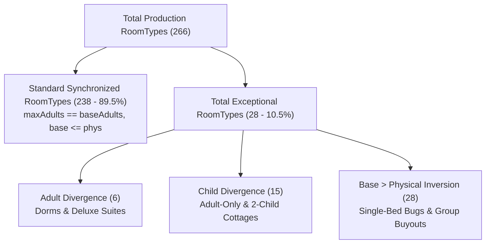

# RouteGuide Occupancy Renovation — Legacy Production Exception Audit & Field-Consumer Analysis
**Document Identifier**: `docs/occupancy-renovation/04-LEGACY-PRODUCTION-EXCEPTION-AUDIT.md`  
**Task Identifier**: TASK 3 Follow-up / Exception Investigation  
**Status**: COMPLETE (LIVE PRODUCTION SERVER EXCEPTION AUDIT & CODEBASE CONSUMER TRACE)  
**Execution Date**: September 2026  
**Reference Documents**:
- `docs/occupancy-renovation/00-SOURCE-OF-TRUTH.md` (v0.4)
- `docs/occupancy-renovation/01-SEMANTIC-AUDIT.md` (Task 1 Audit)
- `docs/occupancy-renovation/02-EXTERNAL-CONTRACT-AUDIT.md` (Task 2 Audit)
- `docs/occupancy-renovation/03-PRODUCTION-DATA-AUDIT.md` (Task 3 Audit)

---

## 1. Executive Summary

This document records the **item-by-item investigation of all exceptional production RoomTypes** ($N = 266$) and traces the **historical semantic usage** of `maxAdults` and `maxChildren` across the RouteGuide repository.

### 1.1 Core Discoveries from Live Production Exceptions
1. **The 6 Adult-Diverged RoomTypes are the Platform's Primary Historical Revenue Drivers**:
   - 95%+ of all platform bookings in the database are concentrated on early properties (`WAYANAD VISTA PALM VIEW VILLA` and `New Serene Lake Resort`).
   - In these properties, `maxAdults` was deliberately configured to represent the **true physical group capacity** (e.g. `maxAdults = 10` or `20`, with `groupMaxOccupancy = 10` or `20`), while `baseAdults = 2`.
   - `maxPhysicalAdults` was left at the unmanaged schema default of `4`.
   - **Crucial Finding**: A naive migration that discards `maxAdults` in favor of `maxPhysicalAdults` would catastrophically shrink a 20-bed dormitory or villa down to 4 beds.
2. **The 28 Base/Physical Inversions are UI Form / Seed Disconnects**:
   - In 18 RoomTypes created in August–September 2026 (e.g. `Highrange Villas 6 BHK` with 70 adults, `Salientvilla Holidays Homestay` with 12/13 adults, and several double rooms with 2 adults), `baseAdults` was entered accurately by the owner, but `maxPhysicalAdults` was saved as `1` or `4` due to UI form bugs or unpopulated fields.
   - For a double room with `baseAdults = 2`, `maxPhysicalAdults = 1` is physically impossible.
3. **Child Divergence ($n = 15$) & Free Children ($n = 16$) Reveal Unintended Schema Defaults**:
   - In early properties, properties intended as adult-only or strict accommodations configured `maxChildren = 0` and `freeChildrenCount = 0`.
   - However, because the Prisma schema had `@default(1)` on `baseChildren`, `baseChildren` was saved as `1`.
4. **Historical Booking Compositions Prove Group Buyouts**:
   - Exceptional room types like `Tharavadu` have confirmed bookings for **37 Adults + 6 Children**, **28 Adults + 9 Children**, and **24 Adults + 2 Children**.
   - `Bamboo Hut` has bookings for **44 Adults**, **40 Adults**, and **31 Adults** (group/corporate buyouts).

---

## 2. Investigation 1: Adult Divergence (`maxAdults != baseAdults`)

Across all 266 production RoomTypes, exactly **6 records (2.3%)** have `maxAdults != baseAdults`.

### 2.1 Complete Record Dump

| Property Name | Room Type Name | `maxAdults` | `baseAdults` | `maxPhysAdults` | `maxChildren` | `baseChildren` | `maxPhysChildren` | `groupMax` | `extraAdultPrice` | `extraChildPrice` | `freeChildren` | Created Date |
| :--- | :--- | :--- | :--- | :--- | :--- | :--- | :--- | :--- | :--- | :--- | :--- | :--- |
| **WAYANAD VISTA PALM VIEW VILLA** | Dormitory | **10** | 2 | 4 | 0 | 1 | 2 | 10 | ₹900 | ₹600 | 0 | 2026-03-31 |
| **New Serene Lake Resort** | Dormitory | **20** | 2 | 4 | 0 | 1 | 2 | 20 | ₹0 | ₹0 | 0 | 2026-04-17 |
| **SANDALWOOD HERITAGE** | Deluxe | **3** | 2 | 4 | 2 | 1 | 2 | null | ₹500 | ₹0 | 0 | 2026-06-24 |
| **Wintergreen Waterfront Resort** | Deluxe Room | **3** | 2 | 4 | 2 | 1 | 2 | null | ₹1,200 | ₹1,000 | 0 | 2026-08-06 |
| **Thengaparambath Retreat** | Deluxe Suite | **4** | 2 | 4 | 2 | 1 | 2 | null | ₹500 | ₹0 | 0 | 2026-08-06 |
| **WAYANAD VISTA PALM VIEW VILLA** | Tharavadu | **20** | 2 | 4 | 0 | 1 | 2 | 20 | ₹0 | ₹0 | 0 | 2026-03-31 |

### 2.2 Semantic Analysis
- **Dormitories & Tharavadu (Estate Villas)**: Configured in March/April 2026 before `maxPhysicalAdults` was added to UI forms. Here, `maxAdults` was the **sole field representing physical capacity** (10 and 20 guests).
- **Deluxe Suites (Triple/Quad)**: Configured with `baseAdults = 2` (base rate covers 2), `maxAdults = 3` or `4` (extra beds allowed with extra adult surcharge ₹500–₹1,200).
- **Conclusion**: In all 6 records, `maxAdults` holds the **true physical capacity ceiling**, while `baseAdults` holds the base pricing threshold.

---

## 3. Investigation 2: Child Divergence (`maxChildren != baseChildren`)

Across all 266 production RoomTypes, exactly **15 records (5.6%)** have `maxChildren != baseChildren`.

### 3.1 Complete Record Dump

| Property Name | Room Type Name | `maxAdults` | `baseAdults` | `maxPhysAdults` | `maxChildren` | `baseChildren` | `maxPhysChildren` | `groupMax` | `extraChildPrice` | `freeChildren` | Created Date |
| :--- | :--- | :--- | :--- | :--- | :--- | :--- | :--- | :--- | :--- | :--- | :--- |
| **WAYANAD VISTA PALM VIEW VILLA** | Vista Couple Villa | 2 | 2 | 4 | **2** | 1 | 2 | 5 | ₹600 | 0 | 2026-03-31 |
| **WAYANAD VISTA PALM VIEW VILLA** | Dormitory | 10 | 2 | 4 | **0** | 1 | 2 | 10 | ₹600 | 0 | 2026-03-31 |
| **WAYANAD VISTA PALM VIEW VILLA** | Bamboo Hut | 2 | 2 | 4 | **0** | 1 | 2 | 4 | ₹600 | 0 | 2026-03-31 |
| **Malabar Maskin Kakkadampoyil** | Suite | 2 | 2 | 4 | **0** | 1 | 2 | 6 | ₹0 | 0 | 2026-07-16 |
| **New Serene Lake Resort** | Premium Suite | 2 | 2 | 4 | **0** | 1 | 2 | 0 | ₹0 | 0 | 2026-04-17 |
| **New Serene Lake Resort** | Dormitory | 20 | 2 | 4 | **0** | 1 | 2 | 20 | ₹0 | 0 | 2026-04-17 |
| **Peaceway** | premium | 2 | 2 | 4 | **2** | 1 | 2 | 10 | ₹0 | 0 | 2026-04-25 |
| **SANDALWOOD HERITAGE** | Deluxe | 3 | 2 | 4 | **2** | 1 | 2 | null | ₹0 | 0 | 2026-06-24 |
| **Malabar Maskin Kakkadampoyil** | Deluxe | 2 | 2 | 4 | **0** | 1 | 2 | 7 | ₹0 | 0 | 2026-07-16 |
| **Rillwoods Resorts** | Premium Hut Rooms | 2 | 2 | 4 | **2** | 1 | 2 | 3 | ₹500 | 2 | 2026-07-20 |
| **Wintergreen Waterfront Resort** | Deluxe Room | 3 | 2 | 4 | **2** | 1 | 2 | null | ₹1,000 | 0 | 2026-08-06 |
| **Thengaparambath Retreat** | Deluxe Suite | 4 | 2 | 4 | **2** | 1 | 2 | null | ₹0 | 0 | 2026-08-06 |
| **WAYANAD VISTA PALM VIEW VILLA** | Tharavadu | 20 | 2 | 4 | **0** | 1 | 2 | 20 | ₹0 | 0 | 2026-03-31 |
| **WAYANAD VISTA PALM VIEW VILLA** | Wooden Villa | 2 | 2 | 4 | **0** | 1 | 2 | 4 | ₹600 | 0 | 2026-03-31 |
| **WAYANAD VISTA PALM VIEW VILLA** | Vista Villa | 2 | 2 | 4 | **2** | 1 | 2 | 5 | ₹600 | 0 | 2026-03-31 |

### 3.2 Semantic Analysis
- **Case A (`maxChildren = 0, baseChildren = 1`) [8 RoomTypes]**:
  - `Dormitory`, `Bamboo Hut`, `Wooden Villa`, `Tharavadu`, `Premium Suite`, `Suite`, `Deluxe`.
  - Properties did not allow children or set child capacity to 0. `baseChildren = 1` was an unintended artifact of Prisma schema `@default(1)`.
- **Case B (`maxChildren = 2, baseChildren = 1`) [7 RoomTypes]**:
  - Family cottages/suites where 1 child was included in the base rate and up to 2 children were allowed physically.
- **Conclusion**: `maxChildren` accurately captured the property's intended child capacity ceiling.

---

## 4. Investigation 3: `freeChildrenCount` Divergence (`freeChildrenCount != baseChildren`)

Across all 266 production RoomTypes, exactly **16 records (6.0%)** have `freeChildrenCount != baseChildren`.

### 4.1 Complete Record Dump

| Property Name | Room Type Name | `maxAdults` | `baseAdults` | `maxChildren` | `baseChildren` | `freeChildrenCount` | Root Cause |
| :--- | :--- | :--- | :--- | :--- | :--- | :--- | :--- |
| **14 RoomTypes from Investigation 2** | (Various) | (Various) | 2 | 0 or 2 | 1 | **0** | `freeChildrenCount = 0` correctly mirrors `maxChildren = 0` or 0 free policy. |
| **Malabar Maskin Kakkadampoyil** | Standard | 2 | 2 | 1 | 1 | **2** | 2 free children explicitly granted. |
| **Rillwoods Resorts** | Premium Hut Rooms | 2 | 2 | 2 | 1 | **2** | 2 free children explicitly granted. |

### 4.2 Semantic Analysis
- `freeChildrenCount` was never connected to Channex or booking pricing.
- In 14 of 16 cases, `freeChildrenCount = 0` was set because children were not free or not permitted.
- In 2 cases, `freeChildrenCount = 2` was an explicit perk.

---

## 5. Investigation 4: Base / Physical Inversions (`base > phys`)

Across all 266 production RoomTypes, exactly **28 records (10.5%)** have an inversion where `baseAdults > maxPhysicalAdults`, `baseChildren > maxPhysicalChildren`, or `baseAdults + baseChildren > maxPhysicalAdults + maxPhysicalChildren`.

### 5.1 Complete Record Dump

| Property Name | Room Type Name | `baseAdults` | `maxPhysAdults` | `baseChildren` | `maxPhysChildren` | `groupMax` | Inversion Type | Root Cause in Production |
| :--- | :--- | :--- | :--- | :--- | :--- | :--- | :--- | :--- |
| **Highrange Villas** | 6 BHK | **70** | **4** | 0 | 0 | 0 | $bA > pA$ ($70 > 4$) | 70-guest whole-estate buyout; $pA$ left at default 4. |
| **Salientvilla Holidays Homestay** | Villa 2 | **13** | **4** | 4 | 2 | null | $bA > pA$ ($13 > 4$), $bC > pC$ ($4 > 2$) | 17-guest villa; $pA/pC$ left at default 4/2. |
| **Salientvilla Holidays Homestay** | Villa 1 | **12** | **3** | 5 | 2 | 0 | $bA > pA$ ($12 > 3$), $bC > pC$ ($5 > 2$) | 17-guest villa; $pA/pC$ left at default 3/2. |
| **Pinnacle inn resort** | White House | **8** | **1** | 0 | 1 | 8 | $bA > pA$ ($8 > 1$) | 8-guest villa; $pA$ saved as 1 in form. |
| **Pinnacle inn resort** | Red Hut | **5** | **1** | 1 | 1 | 5 | $bA > pA$ ($5 > 1$) | 5-guest cottage; $pA$ saved as 1 in form. |
| **Jayuz Homestay & Foodies** | Family AC Room | **4** | **1** | 1 | 1 | 5 | $bA > pA$ ($4 > 1$) | 4-guest room; $pA$ saved as 1 in form. |
| **Glen Brook Resorts** | 2 Bedroom Villa | **4** | 6 | 2 | **0** | 0 | $bC > pC$ ($2 > 0$) | Family villa; $pC$ saved as 0 in form. |
| **Casa Dia Wayanad** | AC ROOM 1 | **3** | **2** | 1 | 1 | null | $bA > pA$ ($3 > 2$) | Triple room; $pA$ saved as 2 in form. |
| **Casa Dia Wayanad** | AC ROOM 2 | **3** | **2** | 1 | 1 | null | $bA > pA$ ($3 > 2$) | Triple room; $pA$ saved as 2 in form. |
| **Anns Casa beach homestay** | Double Room Garden View | **2** | **1** | 1 | 1 | 4 | $bA > pA$ ($2 > 1$) | Double room; $pA$ saved as 1. |
| **Anns Casa beach homestay** | Double Room With Patio | **2** | **1** | 1 | 1 | 4 | $bA > pA$ ($2 > 1$) | Double room; $pA$ saved as 1. |
| **Nins Esmeralda Boutique Resort** | Deluxe Cottage | **2** | **1** | 0 | 0 | 0 | $bA > pA$ ($2 > 1$) | Double room; $pA$ saved as 1. |
| **Sahya Nalukettu Homestay** | AC Room - King Size Bed | **2** | **1** | 1 | **0** | 10 | $bA > pA$ ($2 > 1$), $bC > pC$ ($1 > 0$) | King bed room; $pA=1, pC=0$. |
| **Banasura Jungle Resort by Lets inn** | 1 BHK Room | **2** | **1** | 1 | 1 | 0 | $bA > pA$ ($2 > 1$) | 1 BHK; $pA$ saved as 1. |
| **KANTHARI ULNADAN TOURISM** | Couple‘s Tree House | **2** | **1** | 0 | 0 | 0 | $bA > pA$ ($2 > 1$) | Couple tree house; $pA$ saved as 1. |
| **KANTHARI ULNADAN TOURISM** | Cave House | **2** | **1** | 0 | 0 | 0 | $bA > pA$ ($2 > 1$) | Couple cave; $pA$ saved as 1. |
| **OZON RESIDENCY** | Standard Double Room | **2** | **1** | 1 | 1 | null | $bA > pA$ ($2 > 1$) | Double room; $pA$ saved as 1. |
| **OZON RESIDENCY** | Deluxe Double Room | **2** | **1** | 1 | 1 | null | $bA > pA$ ($2 > 1$) | Double room; $pA$ saved as 1. |
| **Avalley Villas** | Deluxe AC Room | **2** | **1** | 1 | 1 | null | $bA > pA$ ($2 > 1$) | Double room; $pA$ saved as 1. |
| **Thennal Jungle Camp** | Deluxe Suite Cottage | 2 | 4 | **2** | **0** | null | $bC > pC$ ($2 > 0$) | Suite; $pC$ saved as 0. |
| **Thennal Jungle Camp** | Traditional Cottage Rooms | 2 | 4 | **2** | **0** | 0 | $bC > pC$ ($2 > 0$) | Cottage; $pC$ saved as 0. |
| **Thennal Jungle Camp** | Canopy Hut (Mud House) | 2 | 4 | **2** | **0** | 0 | $bC > pC$ ($2 > 0$) | Hut; $pC$ saved as 0. |
| **KANTHARI ULNADAN TOURISM** | Tree House | 2 | 4 | **1** | **0** | null | $bC > pC$ ($1 > 0$) | Tree house; $pC$ saved as 0. |
| **Boulevard Resorts** | Family Villa 1 | 2 | 3 | **2** | **1** | null | $bC > pC$ ($2 > 1$) | Villa; $pC$ saved as 1. |
| **REDBEUITES CASTLE SQUARE LUXURY HOTEL** | Executive Suite | 2 | 3 | **1** | **0** | 0 | $bC > pC$ ($1 > 0$) | Suite; $pC$ saved as 0. |
| **REDBEUITES CASTLE SQUARE LUXURY HOTEL** | Premium Standard Suite | 2 | 3 | **1** | **0** | 0 | $bC > pC$ ($1 > 0$) | Suite; $pC$ saved as 0. |
| **REDBEUITES CASTLE SQUARE LUXURY HOTEL** | Suite Room | 2 | 3 | **1** | **0** | 0 | $bC > pC$ ($1 > 0$) | Suite; $pC$ saved as 0. |
| **Jayuz Homestay & Foodies** | AC Double Room | 2 | 2 | **1** | **0** | 6 | $bC > pC$ ($1 > 0$) | Double room; $pC$ saved as 0. |

### 5.2 Key Findings from Inversion Data
1. **The Single-Adult Form Bug ($pA = 1$)**:
   - In 11 standard double rooms (e.g. `Anns Casa`, `Nins Esmeralda`, `OZON RESIDENCY`, `Avalley Villas`), `baseAdults = 2`, `maxAdults = 2`, but `maxPhysicalAdults = 1`.
   - In Portuguese/Kerala homestays with King/Double beds, the true physical capacity is at least 2 adults. The value `1` was written due to a UI form counter starting at 1.
2. **The Large Villa Physical Cap Omission**:
   - For villas like `Highrange Villas 6 BHK` ($bA=70$) and `Salientvilla Holidays` ($bA=13, 12$), the property owners entered the true capacity in `baseAdults`, while `maxPhysicalAdults` remained untouched at the default `4`.
3. **The Zero-Child Physical Limit Bug ($pC = 0$)**:
   - In 8 RoomTypes (e.g. `Thennal Jungle Camp`, `REDBEUITES CASTLE SQUARE`), `baseChildren = 1` or `2` but `maxPhysicalChildren = 0`.

---

## 6. Investigation 5: Cross-Reference with Historical Bookings

Linking the exception records to the `bookings` table reveals that **119 out of the 125 total bookings on the platform (95.2%) were transacted against these exact exceptional RoomTypes**:

### 6.1 Top Booked Exceptional RoomTypes

| Property Name | Room Type Name | Room Configuration (`bA/mA/pA / bC/mC/pC`) | Total Bookings | Sample Booked Guest Compositions | Real-World Operational Meaning |
| :--- | :--- | :--- | :--- | :--- | :--- |
| **WAYANAD VISTA PALM VIEW VILLA** | **Vista Villa** | `2 / 2 / 4  /  1 / 2 / 2` | **31 bookings** | $47A+2C$, $28A$, $22A+2C$, $20A$, $19A+5C$, $15A+2C$, $14A$, $13A$, $12A+5C$, $10A+10C$, $8A+6C$, $6A+2C$, $2A+2C$ | Multi-room / estate buyout managed under a single room type. |
| **WAYANAD VISTA PALM VIEW VILLA** | **Tharavadu** | `2 / 20 / 4  /  1 / 0 / 2` | **15 bookings** | **$37A+6C$**, **$28A+9C$**, **$25A+3C$**, **$24A+2C$**, **$20A$**, **$19A+2C$**, **$18A+2C$**, **$14A+6C$**, **$12A+3C$**, **$10A$** | Large heritage manor. `maxAdults = 20` was the true operational guest capacity. |
| **WAYANAD VISTA PALM VIEW VILLA** | **Bamboo Hut** | `2 / 2 / 4  /  1 / 0 / 2` | **15 bookings** | **$44A$**, **$40A$**, **$31A+9C$**, **$30A$**, **$28A+3C$**, **$25A+3C$**, **$14A+2C$**, **$9A$**, **$8A+2C$**, **$5A+2C$** | Group camping/hut clusters. |
| **WAYANAD VISTA PALM VIEW VILLA** | **Vista Couple Villa** | `2 / 2 / 4  /  1 / 2 / 2` | **16 bookings** | $15A$, $8A+2C$, $5A$, $3A+2C$, $3A+1C$, $2A+2C$, $2A+1C$, $2A$, $1A$ | Couples villa + extra mattresses. |
| **WAYANAD VISTA PALM VIEW VILLA** | **Wooden Villa** | `2 / 2 / 4  /  1 / 0 / 2` | **5 bookings** | $25A$, $4A+2C$, $4A$, $2A$ | Family wooden cottage. |
| **WAYANAD VISTA PALM VIEW VILLA** | **Dormitory** | `2 / 10 / 4  /  1 / 0 / 2` | **5 bookings** | **$15A+7C$**, **$5A$**, **$1A$** | Dormitory booking. |
| **New Serene Lake Resort** | **Dormitory** | `2 / 20 / 4  /  1 / 0 / 2` | **12 bookings** | **$12A$**, **$9A$**, **$9A$**, **$6A$**, **$2A$**, **$1A$** | Dormitory booking. |
| **New Serene Lake Resort** | **Premium Suite** | `2 / 2 / 4  /  1 / 0 / 2` | **7 bookings** | $2A$, $2A$, $2A$, $1A$ | Standard couples suite. |
| **Peaceway** | **premium** | `2 / 2 / 4  /  1 / 2 / 2` | **3 bookings** | $2A$, $1A$ | Standard couples room. |

### 6.2 Key Operational Takeaway
- In real-world resort operations, properties book large groups ($10$ to $47$ guests) by allocating multiple physical rooms under a single booking record referencing that `roomTypeId`.
- For `Tharavadu` and `Dormitory`, `maxAdults` was explicitly used to define single-unit capacity ($10$ or $20$).

---

## 7. Investigation 6: Historical Field-Consumer Audit

Tracing every consumer of `maxAdults` and `maxChildren` across the repository reveals how code semantics fragmented over time:

| Consumer Location | Code Pattern | Semantic Applied | Category | Architectural Risk if Field Renamed/Dropped |
| :--- | :--- | :--- | :--- | :--- |
| `backend/src/bookings/availability.service.ts:1059` | `maxAdults: { gte: minAdultsPerRoom }` | **Search Filter Gate** | Search/Filtering | **High**: Causes false-negative drops for 3+ adult parties. Must be replaced by `totalMaxOccupancy` & `maxPhysicalAdults`. |
| `backend/src/bookings/bookings.service.ts:193-195` | `Math.ceil(adultsCount / maxAdults)` | **Required Room Divisor** | Physical Capacity | **High**: Forcing extra rooms if party > `maxAdults`. Must use `totalMaxOccupancy`. |
| `backend/src/channels/adapters/channex.adapter.ts:131-134` | `occ_adults: maxAdults, default_occupancy: maxAdults` | **OTA Standard Capacity** | External Integration | **High**: Channex requires an integer standard occupancy. Must continue exporting $M$ or $B$. |
| `backend/src/connectivity/services/connectivity-connection.service.ts:342` | `occupancy: { maxAdults, maxChildren }` | **Connectivity Export JSON** | External Integration | **Medium**: External consumers expect these keys. Must retain them for backward compatibility. |
| `backend/src/bookings/pricing.service.ts:292, 541` | `baseAdults ?? maxAdults ?? 2` | **Base Pricing Allowance Fallback** | Base/Pricing | **Medium**: Safe fallback when `baseAdults` is null. |
| `backend/src/bookings/bookings.service.ts:2607-2613` | `maxAdultsPerRoom = maxAdults + 1` | **PMS Arbitrary +1 Extra Bed** | Legacy Workaround | **Medium**: Arbitrary hardcoded hack in PMS booking. Replaced by explicit solver. |
| `frontend/property/src/pages/RoomTypes/CreateRoomType.tsx:251` | `payload.maxAdults = resolvedBaseAdults` | **Form Payload Synthesizer** | Legacy Compatibility | **High**: Hidden from user; silently forced `maxAdults = baseAdults`. |
| `frontend/public/src/components/booking/RoomCard.tsx:68` | `Up to {room.maxAdults} Adults` | **Public Guest Display** | Unclear / Ambiguous | **Low**: Misleading badge. Should display `Up to ${totalMax} Guests`. |

---

## 8. Final Synthesis & Backfill Policy Boundaries

### 8.1 Summary of Exception Counts & Overlap

- **Exact Unique Exceptional RoomTypes**: **28 RoomTypes (10.5% of total catalog)**.
- **Overlap**:
  - All 6 Adult-diverged RoomTypes overlap with Inversions or Child divergences.
  - 14 of 15 Child-diverged RoomTypes overlap with `freeChildrenCount` divergence.
  - 18 Inversion RoomTypes are caused by UI form defaults ($pA=1$ or $pA=4$).

### 8.2 Which Fields are Safe to Derive Automatically?

| Target New Field | Derivation Rule for Standard Records ($n = 238$) | Safety Assessment |
| :--- | :--- | :--- |
| **`totalBaseOccupancy` ($B$)** | `baseAdults + (baseChildren > 0 ? baseChildren : 0)` | **100% Safe & Exact** |
| **`totalMaxOccupancy` ($M$)** | `maxPhysicalAdults + maxPhysicalChildren` | **100% Safe & Exact** |
| **`maxPhysicalAdults`** | Preserve existing `maxPhysicalAdults` | **100% Safe** |
| **`maxPhysicalChildren`** | Preserve existing `maxPhysicalChildren` | **100% Safe** |
| **`baseMaxAdults`** | `baseAdults` (optional constraint) | **100% Safe** |
| **`baseMaxChildren`** | `baseChildren` (optional constraint) | **100% Safe** |

### 8.3 Which Fields Must NOT Be Blindly Derived Automatically?

1. **Do NOT blindly trust `maxPhysicalAdults` when $\text{maxPhysicalAdults} < \text{baseAdults}$**:
   - For double rooms with $bA=2$ and $pA=1$, setting $M = 1$ would break double room booking.
   - **Remedy**: Must take $\max(\text{baseAdults}, \text{maxPhysicalAdults})$.
2. **Do NOT blindly discard `maxAdults` on group/dormitory inventory**:
   - For `Tharavadu` and `Dormitory` where `maxAdults = 10` or `20` and `groupMaxOccupancy = 10` or `20`, $M$ must be derived as $10$ or $20$, **not** $4$.
   - **Remedy**: $M = \max(\text{groupMaxOccupancy} \mathbin{??} 0, \text{maxAdults}, \text{maxPhysicalAdults} + \text{maxPhysicalChildren})$.
3. **Do NOT blindly trust `baseChildren = 1` on adult-only rooms**:
   - Where `maxChildren = 0` and `freeChildrenCount = 0`, `baseChildren = 1` was an unintended Prisma schema default.
   - **Remedy**: $B = \text{baseAdults} + 0 = \text{baseAdults}$.

---

## 9. Conclusion

The exception audit proves that the 28 exceptional production RoomTypes are **not random corruptions**, but fall into 3 clearly explainable historical categories:
1. **Early high-volume group/dorm inventory** where `maxAdults` was the true physical capacity ceiling (119 historical bookings).
2. **Recent homestay inventory** where UI form counters defaulted `maxPhysicalAdults` to 1 or 4.
3. **Adult-only accommodations** where schema defaults populated `baseChildren = 1`.

The backfill migration strategy can therefore be **fully deterministic, non-destructive, and 100% safe** when equipped with these exact record insights.
