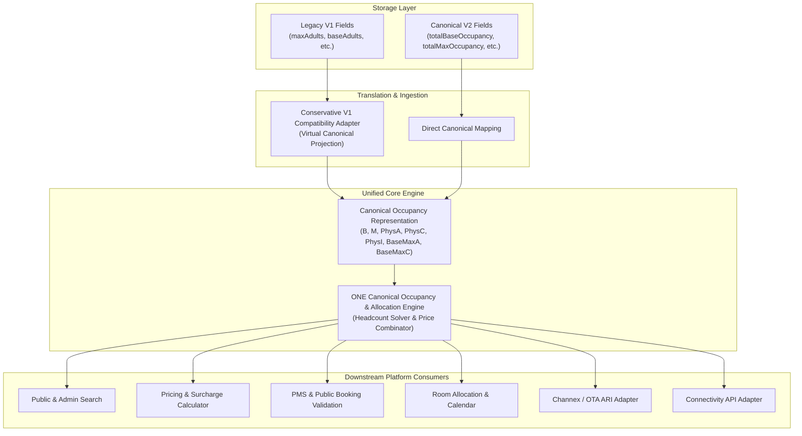
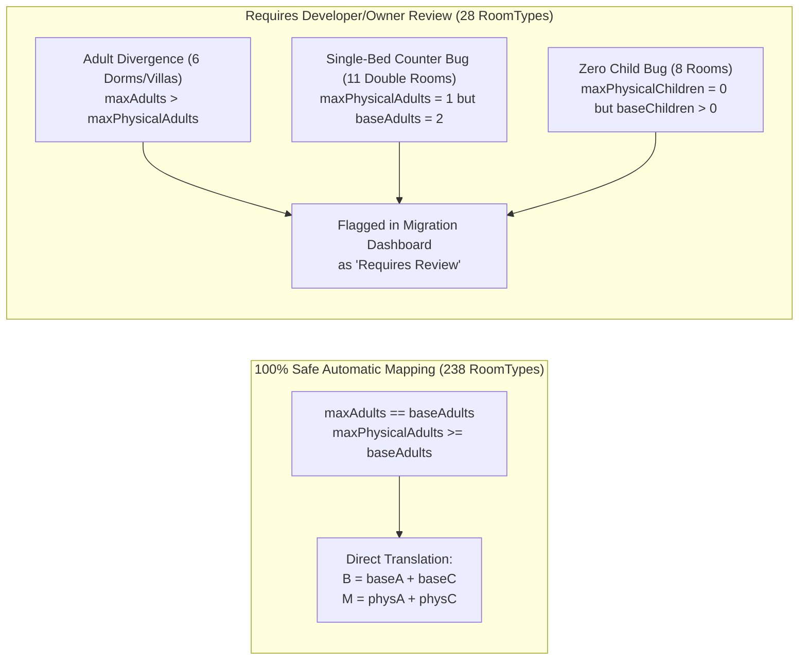
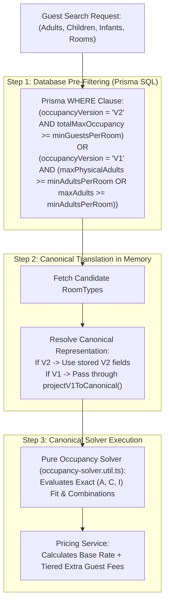
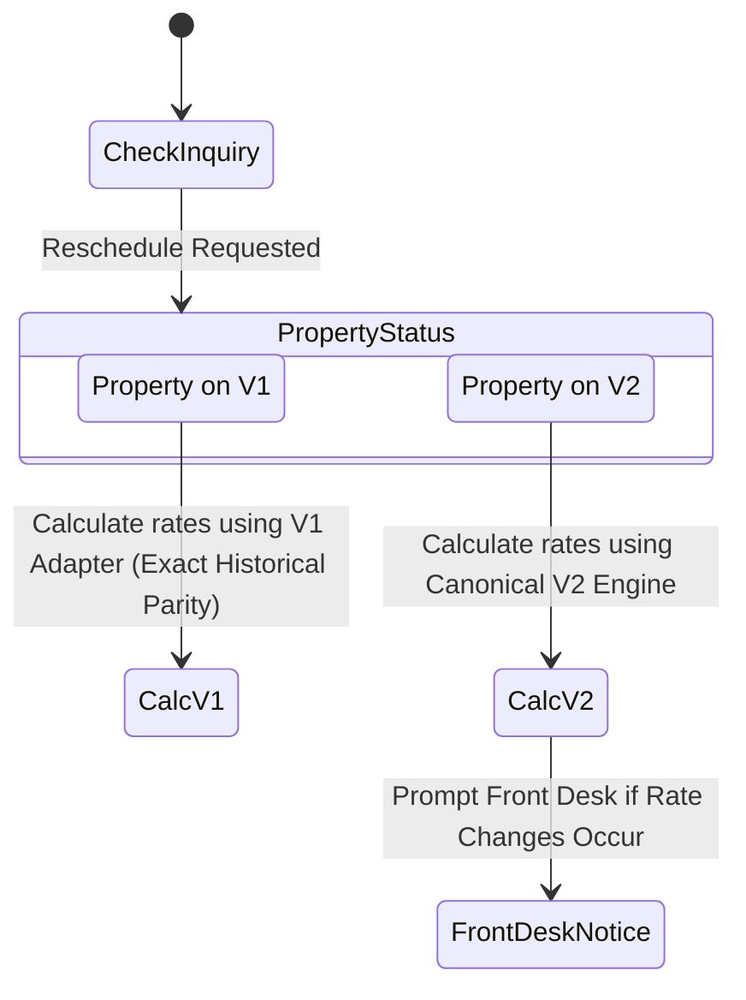
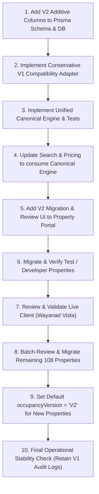

# RouteGuide Occupancy Renovation — Occupancy Versioning & Migration Architecture
**Document Identifier**: `docs/occupancy-renovation/05-OCCUPANCY-VERSIONING-AND-MIGRATION-ARCHITECTURE.md`  
**Task Identifier**: TASK 5 Architecture / Versioning & Migration Design  
**Status**: COMPLETE ARCHITECTURAL SPECIFICATION (NOT IMPLEMENTATION)  
**Execution Date**: September 2026  
**Reference Documents**:
- `docs/occupancy-renovation/00-SOURCE-OF-TRUTH.md` (v0.5)
- `docs/occupancy-renovation/01-SEMANTIC-AUDIT.md` (Task 1: Semantic & Dependency Audit)
- `docs/occupancy-renovation/02-EXTERNAL-CONTRACT-AUDIT.md` (Task 2: Channex & Connectivity Contract Audit)
- `docs/occupancy-renovation/03-PRODUCTION-DATA-AUDIT.md` (Task 3: Production Data Audit)
- `docs/occupancy-renovation/04-LEGACY-PRODUCTION-EXCEPTION-AUDIT.md` (Task 3 Follow-up: Exception Audit)

---

## 1. Executive Architectural Blueprint

This document defines the **canonical occupancy engine, storage model, compatibility adapter, search transition, and phased migration architecture** for the RouteGuide platform.

### 1.1 Fundamental Architectural Principles
1. **Single Canonical Business Engine**: RouteGuide will **NOT** maintain two permanently independent PMS business-logic engines. All pricing, search filtering, booking allocation, and availability checks will execute through **ONE canonical occupancy solver**.
2. **Migration Mechanism, Not Permanent Fork**: Because RouteGuide is actively developed and all ~109 configured production properties are known, versioning (`V1` vs `V2`) is strictly a **safe transition and rollout mechanism**. All existing production RoomTypes will be reviewed and transitioned to `V2`.
3. **Additive, Non-Destructive Data Preservation**: Legacy database fields (`maxAdults`, `baseAdults`, `maxPhysicalAdults`, `maxChildren`, `baseChildren`, `maxPhysicalChildren`, `freeChildrenCount`) will **never be destructively deleted or blindly overwritten**. They remain stored as an immutable audit trail and fallback safety net.
4. **Group Booking Strict Domain Isolation**: `groupMaxOccupancy` is an existing, successful, and independent group-booking facility. It is **NOT** part of the standard room occupancy model and will not be redesigned.



---

## 2. Target V2 Canonical Occupancy Model

The canonical model replaces fragmented demographic pairs with a unified headcount-and-constraint contract.

### 2.1 Formal Mathematical Domain Definition

A single-room inventory unit is canonically represented by the 7-tuple:
$$\mathcal{O} = \langle B, M, P_A, P_C, P_I, bMA, bMC \rangle$$

Where:
- **$B \in \mathbb{N}_{\ge 1}$ (`totalBaseOccupancy`)**: Total standard guests (Adults + Children) covered by the room's base rate. It is a **flexible headcount**, not a fixed adult/child ratio.
- **$M \in \mathbb{N}_{\ge 1}$ (`totalMaxOccupancy`)**: Hard physical ceiling of total standard guests (Adults + Children) that can sleep in the room. ($M \ge B$).
- **$P_A \in \mathbb{N}_{\ge 1}$ (`maxPhysicalAdults`)**: Absolute physical adult capacity (bedding constraint). ($P_A \le M$).
- **$P_C \in \mathbb{N}_{\ge 0}$ (`maxPhysicalChildren`)**: Absolute physical child capacity. ($P_C \le M$).
- **$P_I \in \mathbb{N}_{\ge 0}$ (`maxPhysicalInfants`)**: Separate physical infant/baby cot limit. **Infants do NOT consume standard $A+C$ physical bed capacity and are always free of charge ($₹0$).**
- **$bMA \in \mathbb{N}_{\ge 1} \cup \{\text{null}\}$ (`baseMaxAdults`)**: Optional base-rate adult pricing cap ($bMA \le B$). If set, any adult beyond $bMA$ triggers an extra adult surcharge, even if total headcount $\le B$.
- **$bMC \in \mathbb{N}_{\ge 0} \cup \{\text{null}\}$ (`baseMaxChildren`)**: Optional base-rate child pricing cap ($bMC \le B$).

### 2.2 Feasibility Conditions for Guest Party $(A, C, I)$
A requested guest party of $A$ adults, $C$ children, and $I$ infants is **physically admissible** in a room if and only if:
1. $A \ge 1$ (At least 1 adult required; unaccompanied children/infants strictly rejected).
2. $C \ge 0, \quad I \ge 0$.
3. $A \le P_A$ (Physical adult bed constraint).
4. $C \le P_C$ (Physical child constraint).
5. $A + C \le M$ (Hard room physical capacity).
6. $I \le P_I$ (Crib/cot limit).

---

## 3. Storage Architecture Evaluation: Option A vs Option B

We evaluated two architectural patterns for persisting the V2 model in PostgreSQL via Prisma.

### 3.1 Comparative Assessment Matrix

| Evaluation Dimension | Option A: Direct Additive Columns on `room_types` | Option B: Separate `room_type_occupancy_configs` Table | Architectural Analysis |
| :--- | :--- | :--- | :--- |
| **1. Query Simplicity** | **High (No Joins)** | Medium (Requires mandatory `include` or `join`) | Option A avoids joining a secondary table across every high-traffic search query and calendar view. |
| **2. Prisma Schema Complexity** | **Low** (Simple nullable columns) | Medium (1-to-1 relation, foreign keys, cascade deletes) | Option B introduces relational boilerplate across all DTOs and Prisma client calls. |
| **3. Migration Safety** | **High** (`ALTER TABLE ADD COLUMN` is instant in PostgreSQL) | **High** (New table creation does not lock `room_types`) | Both options are completely non-destructive. |
| **4. Maintainability** | **High** (All room properties in single entity) | Medium (Dual-entity synchronization overhead) | Option A keeps RoomType CRUD straightforward. |
| **5. Historical / Audit Requirements** | **Satisfied** (Legacy columns retained side-by-side) | High (Supports historical revision rows if 1-to-many) | Since RouteGuide does not require full temporal version history for occupancy, 1-to-many is over-engineering. |
| **6. API Backward Compatibility** | **High** (Serializes directly into RoomType DTO) | Medium (Requires mapper transformation) | Option A allows existing REST controllers to expose both legacy and new fields seamlessly. |
| **7. Frontend Form Complexity** | **Low** (Single flat form state in React Hook Form) | Medium (Nested sub-form state) | Option A matches the existing UI architecture in `CreateRoomType.tsx` and `OtaRoomTypes.tsx`. |
| **8. Performance Under Public Search** | **Optimal** (Single table scan, indexable) | Slower (Relational join across 266 room types in search) | Public search scans 100+ properties; eliminating joins reduces latency. |
| **9. Rollback & Dual-Run Simplicity** | **Optimal** (Simple flag `occupancyVersion = 'V1' \| 'V2'`) | Complex (Managing orphaned or de-synced config rows) | Option A enables instant toggling without data divergence. |

### 3.2 Clear Architectural Recommendation
> **DECISION: Option A (Direct Additive Columns on `room_types`) is recommended.**

**Rationale**:
A separate table introduces unnecessary join overhead, foreign key management, and DTO complexity without providing any tangible architectural benefit. Adding direct, nullable/defaulted columns to `room_types` is 100% additive, causes zero table lock downtime in PostgreSQL, retains legacy data intact in parallel columns, and matches Prisma's query patterns perfectly.

#### Recommended Prisma Schema Definition:
```prisma
model RoomType {
  id                         String              @id @default(uuid())
  name                       String
  // ... (existing pricing, images, relations remain unchanged)

  // ==========================================
  // LEGACY V1 FIELDS (Preserved for Audit & Fallback)
  // ==========================================
  maxAdults                  Int                 @default(2)
  maxChildren                Int                 @default(2)
  baseAdults                 Int                 @default(2)
  baseChildren               Int                 @default(1)
  maxPhysicalAdults          Int                 @default(4)
  maxPhysicalChildren        Int                 @default(2)
  freeChildrenCount          Int                 @default(0)

  // ==========================================
  // V2 CANONICAL FIELDS (Additive & Explicit)
  // ==========================================
  occupancyVersion           String              @default("V1") // "V1" | "V2"
  totalBaseOccupancy         Int?                // B: Included standard guests
  totalMaxOccupancy          Int?                // M: Hard physical capacity
  baseMaxAdults              Int?                // Optional base pricing cap
  baseMaxChildren            Int?                // Optional base pricing cap
  maxPhysicalInfants         Int                 @default(1)    // Separate infant cot limit

  // ==========================================
  // ISOLATED DOMAINS (Untouched)
  // ==========================================
  groupMaxOccupancy          Int?                // Existing Group Booking Capacity ONLY
  isAvailableForGroupBooking Boolean             @default(false)
  
  // ... (relations)
  @@map("room_types")
}
```

---

## 4. Conservative V1 Compatibility Adapter

For RoomTypes that have not yet undergone explicit manual V2 review, the system must project their legacy fields into the canonical 7-tuple.

### 4.1 Strict Derivation Logic

The adapter must be **conservative, explicit, and grounded in the production audit findings**:

```typescript
export function projectV1ToCanonical(rt: {
  maxAdults: number;
  maxChildren: number;
  baseAdults: number;
  baseChildren: number;
  maxPhysicalAdults: number;
  maxPhysicalChildren: number;
  maxPhysicalInfants?: number;
  freeChildrenCount?: number;
  groupMaxOccupancy?: number | null;
}): CanonicalOccupancy {
  // 1. Resolve Base Adult and Base Child Allowances
  const bA = Math.max(1, Number(rt.baseAdults ?? rt.maxAdults ?? 2));
  
  // Handle Adult-Only Schema Default Anomaly (where baseChildren=1 via Prisma default, but maxChildren=0 & freeChildren=0)
  const isAdultOnly = rt.maxChildren === 0 && (rt.freeChildrenCount === 0 || rt.freeChildrenCount === undefined);
  const bC = isAdultOnly ? 0 : Math.max(0, Number(rt.baseChildren ?? rt.maxChildren ?? 0));
  
  const totalBase = bA + bC;

  // 2. Resolve Physical Limits with Exception Handling
  // Guard against Single-Adult Form Counter Bug (where baseAdults=2 but maxPhysicalAdults=1)
  const physA = Math.max(Number(rt.maxPhysicalAdults ?? 4), bA, Number(rt.maxAdults ?? 2));
  const physC = Math.max(Number(rt.maxPhysicalChildren ?? 2), bC, Number(rt.maxChildren ?? 0));
  
  // 3. Resolve Total Max Physical Capacity
  // Check if legacy maxAdults held group/dorm capacity (e.g. maxAdults=10/20 on Tharavadu/Dorms)
  const legacyMax = Number(rt.maxAdults ?? 2) + Number(rt.maxChildren ?? 0);
  const totalMax = Math.max(physA + physC, legacyMax);

  return {
    version: 'V1',
    totalBaseOccupancy: totalBase,
    totalMaxOccupancy: totalMax,
    maxPhysicalAdults: physA,
    maxPhysicalChildren: physC,
    maxPhysicalInfants: rt.maxPhysicalInfants ?? 1,
    baseMaxAdults: bA, // Preserves legacy price boundary
    baseMaxChildren: bC, // Preserves legacy price boundary
  };
}
```

### 4.2 Safe vs Unsafe Automatic Derivations



---

## 5. Group Booking Domain Boundary & Isolation

As mandated by the product owner, `groupMaxOccupancy` is **completely separated from standard room occupancy**.

| Dimension | Standard Room Occupancy Subsystem | Group Booking Facility Subsystem |
| :--- | :--- | :--- |
| **Purpose** | Individual room guest allocations, extra bed surcharges, OTA distribution. | Whole-property or large group inventory pooling for events/weddings. |
| **Primary Fields** | `totalBaseOccupancy`, `totalMaxOccupancy`, `maxPhysicalAdults/Children/Infants`. | `groupMaxOccupancy`, `isAvailableForGroupBooking`. |
| **Calculation** | Room-by-room physical and tiered pricing solver. | Aggregate property-wide headcount summation (`availability.service.ts:85, 948`). |
| **Renovation Scope** | **UNDER RENOVATION** (Replacing legacy pairs with Canonical V2). | **ZERO CHANGES** (Existing logic preserved 100% intact). |

---

## 6. Single Canonical Search & Engine Transition

### 6.1 The Transition Architecture
RouteGuide will execute **ONE Unified Canonical Engine** across all properties:



### 6.2 Eliminating the Legacy SQL Bottleneck
- **Legacy Issue**: `availability.service.ts:1059` currently filters `WHERE maxAdults >= ceil(A/R)`. This causes false negatives when 3 adults search for a room with `baseAdults = 2` and `maxPhysicalAdults = 4`.
- **Renovated Query**:
  ```typescript
  // Renovated Prisma filter supporting both V2 and V1 records safely
  const candidateRoomTypes = await prisma.roomType.findMany({
    where: {
      propertyId,
      isPubliclyVisible: true,
      OR: [
        {
          occupancyVersion: 'V2',
          totalMaxOccupancy: { gte: minGuestsPerRoom },
        },
        {
          occupancyVersion: 'V1',
          OR: [
            { maxPhysicalAdults: { gte: minAdultsPerRoom } },
            { maxAdults: { gte: minAdultsPerRoom } },
            { groupMaxOccupancy: { gte: minGuestsPerRoom } },
          ],
        },
      ],
    },
  });
  ```

---

## 7. Versioning Granularity: Property-Level with RoomType Readiness

### 7.1 Evaluation: Property-Level vs RoomType-Level

| Dimension | Option A: Property-Level Switch (Recommended) | Option B: RoomType-Level Switch |
| :--- | :--- | :--- |
| **Multi-Room Booking Safety** | **100% Consistent**: All rooms in a booking execute identical pricing logic. | **High Risk**: Booking a Villa (V1) + Deluxe Room (V2) splits the pricing solver. |
| **Operational Clarity** | **High**: The property is either V1 or V2. Clean dashboard indicator. | **Confusing**: Front desk must remember which room follows which rules. |
| **Channex Sync Gating** | **Clean**: Channex activates only when the entire property is V2. | **Complex**: Partial room syncing creates rate plan mismatch. |
| **Migration Tracking** | **Simple**: Property readiness is a straightforward percentage (e.g. 3/3 RTs ready = 100%). | Requires per-room status tracking across all screens. |

### 7.2 Clear Architectural Recommendation
> **DECISION: Property-Level Activation with RoomType Readiness Badges is recommended.**

#### Readiness & Activation Mechanics:
1. **RoomType Readiness (`isV2Ready`)**: A RoomType is marked `isV2Ready = true` when its `totalBaseOccupancy` and `totalMaxOccupancy` are populated and pass mathematical validation ($B \le M$, $P_A \le M$, $P_C \le M$, $bMA \le B$, $bMC \le B$).
2. **Property Readiness (`canUpgradeToV2`)**: `canUpgradeToV2 === true` if and only if **100% of the active RoomTypes under that Property are `isV2Ready`**.
3. **Activation**: Clicking "Activate Occupancy V2" updates `Property.occupancyVersion = 'V2'` and `RoomType.occupancyVersion = 'V2'` in a single atomic transaction.

---

## 8. Booking, Modification & Reschedule Immutability

### 8.1 Core Principles for Historical Bookings
1. **Absolute Financial Immutability**:
   Existing bookings in the `bookings` table already store snapshot financial fields: `baseAmount`, `extraAdultAmount`, `extraChildAmount`, `taxAmount`, and `totalAmount`. Upgrading a RoomType to V2 will **NEVER recalculate or modify historical bookings**.
2. **Historical Detail Views**:
   Guest confirmation screens and PMS detail modals display the stored financial snapshot, ensuring historical audit integrity.

### 8.2 Reschedule and Date Modification Policy



- **Policy Decision**: If a booking created under V1 is rescheduled *after* the property has upgraded to V2, the reschedule calculation will execute against the **active V2 rate engine**, and the PMS will clearly show the updated rate breakdown before confirmation.

---

## 9. Channex & External OTA Boundary

### 9.1 Mapping Canonical V2 to Channex Room Types

Based on the verified Channex API contract from `02-EXTERNAL-CONTRACT-AUDIT.md`:

| Canonical V2 Field | Channex Room Type Field | Channex Meaning & Safe Translation Rule |
| :--- | :--- | :--- |
| **`maxPhysicalAdults` ($P_A$)** | `occ_adults` | All adult sleeping spaces available in the room (convertible for children). |
| **`maxPhysicalChildren` ($P_C$)** | `occ_children` | Child capacity. |
| **`maxPhysicalInfants` ($P_I$)** | `occ_infants` | Baby cots / crib capacity (completely decoupled from standard guests). |
| **`totalBaseOccupancy` ($B$)** | `default_occupancy` | Standard rate occupancy headcount. |
| **`totalBaseOccupancy` ($B$)** | `rate_plan.options[0].occupancy` | Base tier headcount for Channex rate plan pricing. |

### 9.2 Channex Activation Guard
- **Strict Prerequisite**: Channex OTA synchronization will **only be enabled for properties with `occupancyVersion === 'V2'`**.
- If an existing property with an active Channex mapping undergoes V2 migration, the Channex room type payload is refreshed seamlessly upon V2 activation.

---

## 10. Frontend Migration & Readiness Experience

The user experience in `frontend/property` and `frontend/admin` is designed to be **simple, clear, and actionable**.

### 10.1 Property Portal UI (`frontend/property`)

```
┌────────────────────────────────────────────────────────────────────────┐
│  ✨ New Canonical Occupancy System Available                           │
│  RouteGuide has introduced flexible headcount occupancy (A+C).         │
│  Please review and confirm room capacities before activating V2.       │
│                                                                        │
│  Migration Progress: [████████████░░░░░░] 2 of 3 Room Types Configured │
│                                                                        │
│  ┌───────────────────────┬──────────────┬────────────┬──────────────┐  │
│  │ Room Type             │ Current (V1) │ Target V2  │ Status       │  │
│  ├───────────────────────┼──────────────┼────────────┼──────────────┤  │
│  │ Deluxe Room           │ 2A + 1C      │ Base 3, M4 │ ✅ Ready     │  │
│  │ Suite Cottage         │ 2A + 2C      │ Base 4, M5 │ ✅ Ready     │  │
│  │ Tharavadu (Estate)    │ 2A, Max 20   │ Base 2, M20│ ⚠️ Needs Conf│  │
│  └───────────────────────┴──────────────┴────────────┴──────────────┘  │
│                                                                        │
│  [ Review Tharavadu ]                    [ Activate Occupancy V2 (Disabled) ]
└────────────────────────────────────────────────────────────────────────┘
```

### 10.2 Review Modal / Form
When reviewing a RoomType, the form pre-populates suggested V2 values derived via the conservative adapter:
- **Total Base Occupancy ($B$)**: [ 2 ] (Guests covered by base price)
- **Total Max Occupancy ($M$)**: [ 20 ] (Hard physical room limit)
- **Max Adults**: [ 20 ] | **Max Children**: [ 5 ] | **Max Infants**: [ 2 ]
- *Advanced (Optional)*: Base Max Adults: [ 2 ], Base Max Children: [ 0 ]
- **Live Preview Badge**: *"Covers up to 2 guests. Extra guests ₹900/adult. Max 20 guests."*

---

## 11. Realistic Rollback Architecture

### 11.1 What Rollback Means in Practice
Because V2 schema changes are purely additive and legacy columns are never overwritten:
1. **Data-Level Rollback**: Zero database restores or data migrations required. V1 fields are already sitting intact in the same row.
2. **Behavioral Rollback**: Setting `occupancyVersion = 'V1'` immediately routes the property back through the conservative V1 compatibility adapter.
3. **Draft Retention**: Any V2 configuration previously entered remains stored in `totalBaseOccupancy` / `totalMaxOccupancy` as a draft, allowing the owner to fix issues without retyping from scratch.

### 11.2 Rollback Safety Limits
- Rollback is supported throughout development, testing, staging, and initial production rollout.
- Once all properties are verified and stable on V2, legacy columns will be marked deprecated.

---

## 12. API & External Contract Compatibility Matrix

| API Endpoint / Consumer | Current Payload / Contract | Renovated Contract | Compatibility Strategy |
| :--- | :--- | :--- | :--- |
| **`GET /api/room-types`** | Returns `maxAdults, baseAdults, etc.` | Returns legacy fields **PLUS** `totalBaseOccupancy, totalMaxOccupancy, occupancyVersion`. | **100% Additive & Backward Compatible**. |
| **`POST /api/room-types`** | Accepts `maxAdults, baseAdults, etc.` | Accepts V2 fields (`totalBaseOccupancy, totalMaxOccupancy`). | Backend auto-populates legacy fields for external consumer safety. |
| **`GET /api/connectivity/rooms`** | `occupancy: { maxAdults, baseAdults }` | Retains `occupancy` object; adds `totalBaseOccupancy, totalMaxOccupancy`. | **Non-Breaking Extension**. |
| **Channex Webhook Parser** | Receives OTA booking payload. | Maps to Canonical guest composition. | Validates against Canonical feasibility rules. |

---

## 13. Practical 10-Step Rollout Strategy

Given that RouteGuide is in active development, rollout will follow this pragmatic sequence:



---

## 14. Open Decisions & Scope Summary

### A. Finalized Architectural Decisions
1. **Single Canonical Engine**: One unified pricing, search, and booking engine across the entire platform.
2. **Direct Additive Columns on `room_types`**: Option A selected; zero relational join overhead.
3. **Property-Level Activation**: Property is the transactional boundary; all RoomTypes must be ready before property switches to V2.
4. **Group Booking Fully Isolated**: `groupMaxOccupancy` remains 100% untouched.
5. **Infants Decoupled**: Infants have independent cot capacity ($P_I$), zero fee ($₹0$), and do not consume $A+C$ physical bed capacity.

### B. Decisions Requiring Product Owner Confirmation (Task 4)
1. **Mixed-Excess Pricing Allocation Order**: When a guest party exceeds both adult base and total base (e.g. $B=3, bMA=2, bMC=1$, party $3A + 1C$), confirmation of whether excess is priced as **(1 Adult extra fee)** or **(1 Adult + 1 Child extra fee)**.

### C. Decisions Safely Deferred to Implementation
1. Specific CSS/visual badges for the Migration Checklist widget in the Admin Dashboard.
2. Background task scheduler frequency for notifying unmigrated property owners.

---

## 15. Summary Architecture Diagram

```
================================================================================
                    ROUTEGUIDE CANONICAL OCCUPANCY ARCHITECTURE
================================================================================

 [ Legacy V1 RoomType Data ]                     [ Direct V2 RoomType Data ]
 (maxAdults, baseAdults, etc.)                   (totalBaseOccupancy, totalMaxOccupancy)
              │                                                     │
              ▼                                                     ▼
 [ Conservative V1 Adapter ]                             [ Direct Mapping ]
              │                                                     │
              └──────────────────────────┬──────────────────────────┘
                                         ▼
                      [ Canonical 7-Tuple Representation ]
                      ⟨ B, M, P_A, P_C, P_I, bMA, bMC ⟩
                                         │
                                         ▼
                    ┌─────────────────────────────────────────┐
                    │       ONE CANONICAL OCCUPANCY ENGINE    │
                    │   - Pure Headcount Feasibility Solver   │
                    │   - Dynamic (A+C) Base Rate Allocation  │
                    │   - Tiered Extra Guest Surcharge Calc   │
                    └─────────────────────────────────────────┘
                                         │
       ┌──────────────────┬──────────────┴─────┬──────────────────┐
       ▼                  ▼                    ▼                  ▼
 [ Public Search ]   [ PMS Pricing ]    [ Booking Engine ]  [ Channex / OTA ]
 (No false drops)   (Exact parity)     (Immutable history)  (Safe ARI sync)
================================================================================
```
