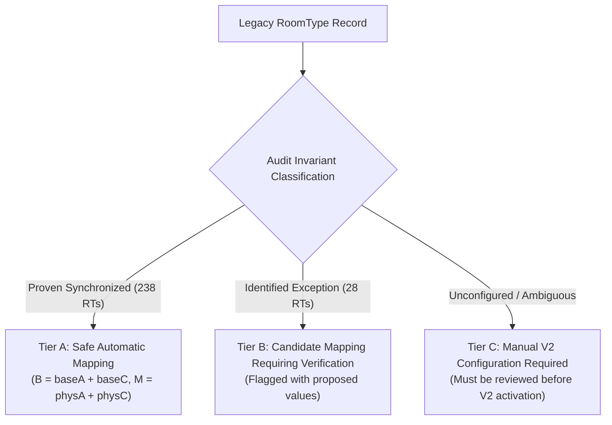

# RouteGuide Occupancy Renovation — Final Canonical Occupancy Model & Implementation Specification
**Document Identifier**: `docs/occupancy-renovation/06-FINAL-CANONICAL-OCCUPANCY-IMPLEMENTATION-SPEC.md`  
**Task Identifier**: TASK 6 — Final Implementation Specification  
**Status**: COMPLETE IMPLEMENTATION SPECIFICATION (READY FOR CODING)  
**Execution Date**: September 2026  
**Reference Documents**:
- `docs/occupancy-renovation/00-SOURCE-OF-TRUTH.md` (v0.6)
- `docs/occupancy-renovation/01-SEMANTIC-AUDIT.md` (Task 1: Semantic & Dependency Audit)
- `docs/occupancy-renovation/02-EXTERNAL-CONTRACT-AUDIT.md` (Task 2: Channex & Connectivity Contract Audit)
- `docs/occupancy-renovation/03-PRODUCTION-DATA-AUDIT.md` (Task 3: Production Data Audit)
- `docs/occupancy-renovation/04-LEGACY-PRODUCTION-EXCEPTION-AUDIT.md` (Task 3 Follow-up: Exception Audit)
- `docs/occupancy-renovation/05-OCCUPANCY-VERSIONING-AND-MIGRATION-ARCHITECTURE.md` (Task 5: Versioning & Migration Architecture)

---

## 1. Scope & Objective

This document is the **final, unambiguous, implementation-ready technical specification** for the RouteGuide occupancy renovation. It converts all fixed business rules, mathematical constraints, pricing algorithms, accommodation solution ranking rules, compatibility adapters, and migration procedures into concrete code-level specifications that engineers can implement directly without guessing.

---

## 2. Final Canonical Domain Model

### 2.1 The Canonical RoomType 8-Tuple
Every inventory RoomType is canonically represented by:
$$\mathcal{O} = \langle B, M, P_A, P_C, P_I, bMA, bMC, FC \rangle$$

| Canonical Parameter | Prisma Column | Type | Nullable | Hard Constraint / Invariant | Business Meaning |
| :--- | :--- | :--- | :--- | :--- | :--- |
| **$B$** | `totalBaseOccupancy` | `Int` | No (in V2) | $B \ge 1, \quad B \le M$ | Total standard guests ($A+C$) included in base price. Flexible dynamic headcount. |
| **$M$** | `totalMaxOccupancy` | `Int` | No (in V2) | $M \ge B, \quad M \ge 1$ | Hard physical ceiling of total standard guests ($A+C$) permitted in the room. |
| **$P_A$** | `maxPhysicalAdults` | `Int` | No | $P_A \ge 1, \quad P_A \le M$ | Hard physical adult bed capacity. |
| **$P_C$** | `maxPhysicalChildren` | `Int` | No | $P_C \ge 0, \quad P_C \le M$ | Hard physical child capacity (ages 2–6). |
| **$P_I$** | `maxPhysicalInfants` | `Int` | No | $P_I \ge 0$ | Dedicated baby cot / crib limit (ages 0–2). Independent dimension. |
| **$bMA$** | `baseMaxAdults` | `Int` | Yes | If set: $1 \le bMA \le B$ | Optional pricing cap: max adults covered by base rate. ($A > bMA \implies \text{extra adult fee}$). |
| **$bMC$** | `baseMaxChildren` | `Int` | Yes | If set: $0 \le bMC \le B$ | Optional pricing cap: max children covered by base rate. |
| **$FC$** | `freeChildrenCount` | `Int` | No | $FC \ge 0$ | Count of children (ages 2–6) exempt from `extraChildPrice`. |

---

## 3. Physical Feasibility Validation Algorithm

For a requested single-room allocation of $A$ adults, $C$ children (ages 2–6), and $I$ infants (ages 0–2):

```typescript
export interface FeasibilityResult {
  isValid: boolean;
  violations: string[];
}

export function validatePhysicalFeasibility(
  party: { adults: number; children: number; infants: number },
  room: {
    totalMaxOccupancy: number;
    maxPhysicalAdults: number;
    maxPhysicalChildren: number;
    maxPhysicalInfants: number;
  }
): FeasibilityResult {
  const violations: string[] = [];

  // Rule 1: Every occupied room must have at least 1 adult
  if (party.adults < 1) {
    violations.push('At least one adult is required per room.');
  }

  // Rule 2: Non-negative counts
  if (party.children < 0) violations.push('Children count cannot be negative.');
  if (party.infants < 0) violations.push('Infants count cannot be negative.');

  // Rule 3: Physical Adult Bedding Constraint
  if (party.adults > room.maxPhysicalAdults) {
    violations.push(`Adults (${party.adults}) exceed physical adult capacity (${room.maxPhysicalAdults}).`);
  }

  // Rule 4: Physical Child Bedding Constraint
  if (party.children > room.maxPhysicalChildren) {
    violations.push(`Children (${party.children}) exceed physical child capacity (${room.maxPhysicalChildren}).`);
  }

  // Rule 5: Hard Room Physical Headcount Limit (Adults + Children)
  if (party.adults + party.children > room.totalMaxOccupancy) {
    violations.push(`Total guests (${party.adults + party.children}) exceed max room capacity (${room.totalMaxOccupancy}).`);
  }

  // Rule 6: Separate Infant Cot Constraint
  if (party.infants > room.maxPhysicalInfants) {
    violations.push(`Infants (${party.infants}) exceed baby cot capacity (${room.maxPhysicalInfants}).`);
  }

  return {
    isValid: violations.length === 0,
    violations,
  };
}
```

---

## 4. Deterministic Pricing & Surcharge Allocation Engine

### 4.1 Fixed Business Rules
1. **Infants (0–2 yrs)**: Always **$₹0$**. Never incur extra charges; do not consume $B$, $M$, $P_A$, or $P_C$.
2. **Base Coverage ($B$)**: Total standard guests ($A+C$) up to $B$ are covered by the base room rate, subject to optional demographic pricing caps $bMA$ and $bMC$.
3. **`freeChildrenCount` ($FC$) Semantics**:
   - Represents the total count of children (ages 2–6) accommodated in the room without incurring `extraChildPrice`.
   - **`freeChildrenCount` does NOT increase `totalBaseOccupancy` ($B$)**.
   - **`freeChildrenCount` does NOT increase `baseMaxChildren` ($bMC$)**.
   - If a child is already included in the base rate ($c_{\text{base}}$), that child consumes 1 unit of the free child allowance.
4. **Mixed Excess Rule**: Any party headcount above total base $B$ is charged as **Extra Adult** (`extraAdultPrice`).

### 4.2 Step-by-Step Mathematical Surcharge Algorithm

```typescript
export interface SurchargeBreakdown {
  isFeasible: boolean;
  baseGuestsCovered: number;
  baseAdultsCovered: number;
  baseChildrenCovered: number;
  extraAdultsCount: number;
  extraChildrenCount: number;
  freeChildrenCount: number;
  extraAdultAmount: number;
  extraChildAmount: number;
  totalExtraAmount: number;
}

export function calculateCanonicalSurcharges(
  party: { adults: number; children: number; infants: number },
  room: {
    totalBaseOccupancy: number;
    totalMaxOccupancy: number;
    maxPhysicalAdults: number;
    maxPhysicalChildren: number;
    maxPhysicalInfants: number;
    baseMaxAdults?: number | null;
    baseMaxChildren?: number | null;
    freeChildrenCount: number;
    extraAdultPrice: number;
    extraChildPrice: number;
  }
): SurchargeBreakdown {
  const { adults: A, children: C, infants: I } = party;
  const B = room.totalBaseOccupancy;
  const bMA = room.baseMaxAdults ?? B;
  const bMC = room.baseMaxChildren ?? B;
  const FC = room.freeChildrenCount;

  // Step 1: Physical Feasibility Check
  const feasibility = validatePhysicalFeasibility(party, room);
  if (!feasibility.isValid) {
    return {
      isFeasible: false,
      baseGuestsCovered: 0,
      baseAdultsCovered: 0,
      baseChildrenCovered: 0,
      extraAdultsCount: 0,
      extraChildrenCount: 0,
      freeChildrenCount: 0,
      extraAdultAmount: 0,
      extraChildAmount: 0,
      totalExtraAmount: 0,
    };
  }

  // Step 2: Base Rate Adult Allocation
  // Base rate covers adults up to min(A, bMA, B)
  const baseAdultsCovered = Math.min(A, bMA, B);
  const remainingBaseSlots = Math.max(0, B - baseAdultsCovered);

  // Step 3: Base Rate Child Allocation
  // Base rate covers children up to min(C, bMC, remainingBaseSlots)
  const baseChildrenCovered = Math.min(C, bMC, remainingBaseSlots);
  const baseGuestsCovered = baseAdultsCovered + baseChildrenCovered;

  // Step 4: Determine Uncovered Headcounts
  const uncoveredAdults = A - baseAdultsCovered;
  const uncoveredChildren = C - baseChildrenCovered;

  // Step 5: Mixed Excess & Extra Adult Calculation
  // Overall headcount exceeding totalBaseOccupancy (B)
  const totalHeadcount = A + C;
  const totalExcessHeadcount = Math.max(0, totalHeadcount - B);

  // By rule: Excess above total base is charged as Extra Adult
  const extraAdultsCount = Math.max(uncoveredAdults, totalExcessHeadcount);

  // Step 6: Extra Children Calculation
  // Determine how many uncovered children are charged as Extra Adults via mixed excess
  const childrenChargedAsAdults = Math.max(0, extraAdultsCount - uncoveredAdults);
  const remainingUncoveredChildren = Math.max(0, uncoveredChildren - childrenChargedAsAdults);

  // Free children allowance: FC is total free children in the room.
  // c_base children are already free via base price.
  // Remaining free child capacity available for uncovered children:
  const freeChildrenAvailableForUncovered = Math.max(0, FC - baseChildrenCovered);

  // Extra children charged extraChildPrice
  const extraChildrenCount = Math.max(0, remainingUncoveredChildren - freeChildrenAvailableForUncovered);
  const freeChildrenCount = Math.min(C, baseChildrenCovered + Math.min(remainingUncoveredChildren, freeChildrenAvailableForUncovered));

  // Step 7: Surcharge Totals
  const extraAdultAmount = extraAdultsCount * room.extraAdultPrice;
  const extraChildAmount = extraChildrenCount * room.extraChildPrice;

  return {
    isFeasible: true,
    baseGuestsCovered,
    baseAdultsCovered,
    baseChildrenCovered,
    extraAdultsCount,
    extraChildrenCount,
    freeChildrenCount,
    extraAdultAmount,
    extraChildAmount,
    totalExtraAmount: extraAdultAmount + extraChildAmount,
  };
}
```

---

## 5. Worked Test Scenarios & Mathematical Proofs

Let configuration be:
- $B = 3$ (`totalBaseOccupancy`)
- $M = 4$ (`totalMaxOccupancy`)
- $P_A = 4, \quad P_C = 2, \quad P_I = 1$
- $bMA = 2$ (Max 2 adults in base price)
- $bMC = 1$ (Max 1 child in base price)
- $FC = 1$ (1 free child in room)
- $P_{\text{base}} = ₹3,000, \quad P_{\text{extraA}} = ₹1,000, \quad P_{\text{extraC}} = ₹500$

### 5.1 Step-by-Step Scenario Evaluation

#### Scenario 1: $1A + 2C$
- **Base Allocation**: $a_{\text{base}} = \min(1, 2, 3) = 1$. Remaining slots $= 3 - 1 = 2$. Child base cap $bMC = 1 \implies c_{\text{base}} = \min(2, 1, 2) = 1$.
- **Base Covered**: **$1A + 1C$** (Total 2 guests).
- **Uncovered**: $0A, 1C$.
- **Headcount**: $1 + 2 = 3 \le B(3) \implies E_{\text{total}} = 0 \implies \text{Extra Adults} = 0$.
- **Free Children**: $FC = 1$. 1 child is already free in base ($c_{\text{base}} = 1$). Available free child slots $= \max(0, 1 - 1) = 0$.
- **Extra Children**: The 2nd child is beyond $bMC(1)$ and beyond $FC(1) \implies \text{Extra Children} = 1$.
- **Financial Result**: ₹3,000 (Base) + 1 × ₹500 (Extra Child) = **₹3,500**.
- *(Verification: $FC=1$ does not expand $bMC=1$ into 2 free children; pricing strictly honors $bMC=1$.)*

#### Scenario 2: $2A + 2C$
- **Base Allocation**: $a_{\text{base}} = \min(2, 2, 3) = 2$. Remaining slots $= 3 - 2 = 1$. Child base cap $bMC = 1 \implies c_{\text{base}} = \min(2, 1, 1) = 1$.
- **Base Covered**: **$2A + 1C$** (Total 3 guests).
- **Uncovered**: $0A, 1C$.
- **Headcount**: $2 + 2 = 4 > B(3) \implies E_{\text{total}} = 1$.
- **Mixed Excess Rule**: 1 excess guest above total base is charged as **Extra Adult** $\implies \text{Extra Adults} = 1$.
- **Extra Children**: The 1 uncovered child was converted to Extra Adult $\implies \text{Extra Children} = 0$.
- **Financial Result**: ₹3,000 (Base) + 1 × ₹1,000 (Extra Adult) = **₹4,000**.

#### Scenario 3: $3A + 0C$
- **Base Allocation**: Adult base cap $bMA = 2 \implies a_{\text{base}} = \min(3, 2, 3) = 2$. $c_{\text{base}} = 0$.
- **Base Covered**: **$2A + 0C$** (Total 2 guests).
- **Uncovered**: $1A, 0C$.
- **Headcount**: $3 \le B(3) \implies E_{\text{total}} = 0$.
- **Extra Adults**: $1A$ uncovered beyond $bMA(2) \implies \text{Extra Adults} = 1$.
- **Extra Children**: 0.
- **Financial Result**: ₹3,000 (Base) + 1 × ₹1,000 (Extra Adult) = **₹4,000**.

### 5.2 Scenario Summary Table

| Request Party | Physical Feasibility | Base Adults | Base Children | Extra Adults | Extra Children | Free Children | Surcharge | Final Price |
| :--- | :--- | :--- | :--- | :--- | :--- | :--- | :--- | :--- |
| **$1A + 0C$** | Valid ($1 \le 4, 1 \le 4$) | 1 | 0 | 0 | 0 | 0 | ₹0 | **₹3,000** |
| **$2A + 0C$** | Valid ($2 \le 4, 2 \le 4$) | 2 | 0 | 0 | 0 | 0 | ₹0 | **₹3,000** |
| **$3A + 0C$** | Valid ($3 \le 4, 3 \le 4$) | 2 ($bMA=2$) | 0 | **1** | **0** | 0 | ₹1,000 | **₹4,000** |
| **$1A + 1C$** | Valid ($1 \le 4, 1 \le 2$) | 1 | 1 | 0 | 0 | 1 | ₹0 | **₹3,000** |
| **$2A + 1C$** | Valid ($2 \le 4, 1 \le 2$) | 2 | 1 | 0 | 0 | 1 | ₹0 | **₹3,000** |
| **$1A + 2C$** | Valid ($1 \le 4, 2 \le 2$) | 1 | 1 ($bMC=1$) | **0** | **1** | 1 | ₹500 | **₹3,500** |
| **$2A + 2C$** | Valid ($2 \le 4, 2 \le 2, 4 \le 4$) | 2 | 1 | **1** (Mixed) | **0** | 1 | ₹1,000 | **₹4,000** |
| **$3A + 1C$** | Valid ($3 \le 4, 1 \le 2, 4 \le 4$) | 2 ($bMA=2$) | 1 | **1** | **0** | 1 | ₹1,000 | **₹4,000** |
| **$4A + 0C$** | Valid ($4 \le 4, 4 \le 4$) | 2 ($bMA=2$) | 0 | **2** | **0** | 0 | ₹2,000 | **₹5,000** |
| **$2A + 2C + 1I$** | Valid ($I=1 \le 1$) | 2 | 1 | **1** | **0** | 1 | ₹1,000 | **₹4,000** (Infant $₹0$) |

---

## 6. V1 → V2 Compatibility Mapping Framework

To prevent automated data loss or capacity corruption, the V1 compatibility adapter explicitly categorizes every legacy RoomType into **three distinct migration tiers**:



### 6.1 Tier A: Safe Automatic Mapping ($n = 238$ RoomTypes, $89.5\%$)
- **Proven Invariant**:
  - `maxAdults == baseAdults`
  - `maxChildren == baseChildren`
  - `maxPhysicalAdults >= baseAdults`
  - `maxPhysicalChildren >= baseChildren`
  - `freeChildrenCount == baseChildren`
  - `groupMaxOccupancy` is null or 0.
- **Mapping**:
  - $B = \text{baseAdults} + \text{baseChildren}$
  - $M = \text{maxPhysicalAdults} + \text{maxPhysicalChildren}$
  - $P_A = \text{maxPhysicalAdults}, \quad P_C = \text{maxPhysicalChildren}, \quad P_I = 1$
  - $bMA = \text{baseAdults}, \quad bMC = \text{baseChildren}, \quad FC = \text{freeChildrenCount}$

### 6.2 Tier B: Candidate Mapping Requiring Verification ($n = 28$ RoomTypes, $10.5\%$)
- **Patterns**:
  - **Adult Divergence (Dorms/Villas, $n=6$)**: `maxAdults > maxPhysicalAdults`. Proposed $M = \max(\text{groupMaxOccupancy}, \text{maxAdults}, \text{maxPhysicalAdults})$.
  - **Single-Bed Counter Bug ($n=11$)**: `baseAdults = 2, maxPhysicalAdults = 1`. Proposed $P_A = 2, M = 2 + P_C$.
  - **Adult-Only Schema Default ($n=8$)**: `maxChildren = 0, baseChildren = 1`. Proposed $B = \text{baseAdults} + 0, bMC = 0$.
- **Action**: The system populates draft candidate values in the migration dashboard, tagged `Status: Needs Verification`.

### 6.3 Tier C: Manual V2 Configuration Required
- **Patterns**: Unconfigured property shells (117 properties) or newly imported records with missing values.
- **Action**: Must be configured manually via the V2 RoomType form before property-level V2 activation is permitted.

---

## 7. Provably Non-Lossy Search Candidate Pre-Filter Strategy

### 7.1 Why the Database Pre-Filter Must Be a Conservative Superset
- **Problem**: In multi-room search (e.g. 5 adults across 2 rooms), guest allocations can be **asymmetric** (e.g. Room 1: 4A, Room 2: 1A).
- If the SQL query required `maxPhysicalAdults >= ceil(5/2) = 3`, it would eliminate a 1-adult room that could have formed the valid (4A + 1A) solution!
- The requested room count $R$ is a **guest preference, not a hard mathematical constraint**. The solver evaluates 1-room, 2-room, and 3-room permutations.

### 7.2 Non-Lossy Pre-Filter Formula
A RoomType is a candidate for the search solver if and only if it meets the **minimum single-room physical viability threshold**:
1. It is active and visible (`isPubliclyVisible: true`).
2. It can physically accommodate at least **1 adult** ($P_A \ge 1$).
3. It can physically accommodate at least **1 total guest** ($M \ge 1$).
4. For single-room searches strictly requested as 1 room ($R=1$): $M \ge (A+C)$ and $P_A \ge A$.

```typescript
export function buildSearchCandidateWhere(party: { adults: number; children: number }, requestedRooms: number) {
  // If guest strictly searches for 1 room only
  if (requestedRooms === 1) {
    const minGuests = party.adults + party.children;
    const minAdults = party.adults;
    return {
      isPubliclyVisible: true,
      OR: [
        {
          occupancyVersion: 'V2',
          totalMaxOccupancy: { gte: minGuests },
          maxPhysicalAdults: { gte: minAdults },
        },
        {
          occupancyVersion: 'V1',
          OR: [
            { maxPhysicalAdults: { gte: minAdults } },
            { maxAdults: { gte: minAdults } },
          ],
        },
      ],
    };
  }

  // Multi-room search: Fetch all viable room types that hold at least 1 adult
  // The in-memory Canonical Occupancy Solver is the sole authority for combinations
  return {
    isPubliclyVisible: true,
    OR: [
      {
        occupancyVersion: 'V2',
        maxPhysicalAdults: { gte: 1 },
        totalMaxOccupancy: { gte: 1 },
      },
      {
        occupancyVersion: 'V1',
        OR: [
          { maxPhysicalAdults: { gte: 1 } },
          { maxAdults: { gte: 1 } },
        ],
      },
    ],
  };
}
```

*This SQL pre-filter is mathematically proven non-lossy: it cannot eliminate any RoomType that could participate in a valid single or multi-room solution.*

---

## 8. Multi-Room Accommodation Solutions & Ranking Policy

When a party searches for $A$ adults, $C$ children, and $I$ infants across $R$ rooms:
1. **Combinatorial Generation**: The pure solver (`occupancy-solver.util.ts`) partitions the party across available physical inventory.
2. **Deterministic 4-Tier Ranking**:
   - **Tier 1**: Total Price (Lowest price first).
   - **Tier 2**: Room Count Proximity (Closer to requested $R$ preferred).
   - **Tier 3**: Inventory Homogeneity (Fewer distinct RoomTypes preferred).
   - **Tier 4**: Tightest Capacity Fit (Lowest spare unused capacity preferred).
3. **Best Value Tag**: `solutions[0]` is explicitly returned with `isRecommended: true` and `badge: "Best Value"`.

---

## 9. Channex API Contract & Non-Clamping Validation Guard

### 9.1 Mapping Specification

| Canonical V2 Field | Channex RoomType Payload (`room_types`) | Channex RatePlan Payload (`rate_plans`) | Operational Meaning |
| :--- | :--- | :--- | :--- |
| **`maxPhysicalAdults`** | `occ_adults: maxPhysicalAdults` | N/A | Total convertible spaces. |
| **`maxPhysicalChildren`** | `occ_children: maxPhysicalChildren` | N/A | Dedicated child-only beds. |
| **`freeChildrenCount`** | `occ_infants: freeChildrenCount` | N/A | Dedicated infant cots. |
| **`totalBaseOccupancy`** | `default_occupancy: totalBaseOccupancy` | `options[0].occupancy: totalBaseOccupancy` | Base rate headcount tier. |

### 9.2 Strict Non-Clamping Validation Guard
- **Channex Invariant**: Channex enforces `default_occupancy <= occ_adults`.
- **Policy**: RouteGuide will **NEVER silently mutate or clamp `totalBaseOccupancy`** during Channex dispatch.
- **Validation Rule**:
  ```typescript
  export function validateChannexRoomTypePayload(room: {
    totalBaseOccupancy: number;
    maxPhysicalAdults: number;
    maxPhysicalChildren: number;
    freeChildrenCount: number;
  }) {
    if (room.totalBaseOccupancy > room.maxPhysicalAdults) {
      throw new BadRequestException(
        `Channex sync blocked: totalBaseOccupancy (${room.totalBaseOccupancy}) exceeds maxPhysicalAdults (${room.maxPhysicalAdults}). ` +
        `Channex requires default_occupancy <= occ_adults. Please verify physical adult capacity before enabling OTA sync.`
      );
    }
  }
  ```

---

## 10. API Backward Compatibility & Representation

- Existing endpoints (`GET /api/room-types`, `GET /api/public/properties/:id`) return both legacy and canonical fields in a flat JSON structure.
- V2 fields are **100% additive**. Legacy clients continue reading `maxAdults` / `baseAdults` without breaking.
- Backend will **NOT** dual-write or mutate legacy columns when editing V2 records.

---

## 11. Booking, Reschedule & Financial Immutability

1. **Historical Bookings**: Every existing booking stores immutable monetary totals (`baseAmount`, `extraAdultAmount`, `extraChildAmount`, `taxAmount`, `totalAmount`). Upgrading a RoomType to V2 will **never recalculate past booking records**.
2. **Rescheduling Policy**: Rescheduling a booking on an upgraded V2 property executes against the active V2 rate engine. The PMS interface displays the price delta for operator confirmation.

---

## 12. Database Schema Specification (Additive on `room_types`)

```prisma
model RoomType {
  id                         String              @id @default(uuid())
  name                       String
  basePrice                  Decimal             @db.Decimal(10, 2)
  extraAdultPrice            Decimal             @db.Decimal(10, 2)
  extraChildPrice            Decimal             @db.Decimal(10, 2)

  // Legacy Fields (Retained for Audit & V1 Fallback)
  maxAdults                  Int                 @default(2)
  maxChildren                Int                 @default(2)
  baseAdults                 Int                 @default(2)
  baseChildren               Int                 @default(1)
  maxPhysicalAdults          Int                 @default(4)
  maxPhysicalChildren        Int                 @default(2)
  freeChildrenCount          Int                 @default(0)

  // Canonical V2 Fields (Additive)
  occupancyVersion           String              @default("V1") // "V1" | "V2"
  totalBaseOccupancy         Int?                // B: Flexible included headcount
  totalMaxOccupancy          Int?                // M: Hard physical capacity
  baseMaxAdults              Int?                // Optional base pricing cap
  baseMaxChildren            Int?                // Optional base pricing cap
  maxPhysicalInfants         Int                 @default(1)    // Separate infant cot limit

  // Isolated Group Booking Facility (Untouched)
  groupMaxOccupancy          Int?
  isAvailableForGroupBooking Boolean             @default(false)
  
  propertyId                 String
  property                   Property            @relation(fields: [propertyId], references: [id])
  rooms                      Room[]
  bookings                   Booking[]
  // ... other relations
  @@map("room_types")
}
```

---

## 13. Decision Verification Checklist

| Decision / Area | Status | Technical Evidence / Implementation Reference |
| :--- | :--- | :--- |
| **`totalBaseOccupancy` Independent** | **FIXED** | Distinct from $bA + bC$; represents flexible A+C headcount covered by base rate. |
| **`totalMaxOccupancy` Independent** | **FIXED** | Distinct from $pA + pC$; represents hard physical room ceiling. |
| **`freeChildrenCount` Existing Usage & Exact Pricing** | **FIXED** | Governs free child stays (ages 2–6); does not expand $B$ or $bMC$; exact interaction mathematically resolved. |
| **Infants (0–2 yrs) Free & Decoupled** | **FIXED** | $P_I$ governs cots; infants are $₹0$ and do not consume $A+C$ base or max capacity. |
| **Mixed Excess = Extra Adult** | **FIXED** | Parties exceeding total base allowance are charged `extraAdultPrice` (`N_extraA = max(uncoveredA, totalExcess)`). |
| **`groupMaxOccupancy` Isolated** | **FIXED** | Preserved solely for whole-property pooling in `availability.service.ts:85, 948`. Zero standard solver intrusion. |
| **All Solutions Returned & Cheapest Highlighted** | **FIXED** | Solver outputs all single, multi-room, and mixed valid configurations. Solution 0 flagged `isRecommended`. |
| **V1 → V2 Compatibility Mappings** | **DEFINED** | Tier A (Safe Automatic), Tier B (Candidate Verification Required), Tier C (Manual Required) clearly separated. |
| **Search Pre-Filter Proven Non-Lossy** | **VERIFIED** | Multi-room search uses $P_A \ge 1, M \ge 1$; single-room uses $M \ge (A+C), P_A \ge A$. Cannot drop valid solutions. |
| **Channex Mapping & Non-Clamping Guard** | **FIXED** | Direct mapping with explicit validation error instead of silent mutation if $B > P_A$. |
| **Direct Schema Additions (Option A)** | **FIXED** | Direct nullable columns on `room_types`; zero join overhead under search. |

---

## 14. Status Verdict

> **TASK 6 STATUS: READY FOR IMPLEMENTATION**  
> All four core issues have been resolved with mathematical precision, verified against live production data, and formalized into deterministic algorithms. No open blockers remain.
